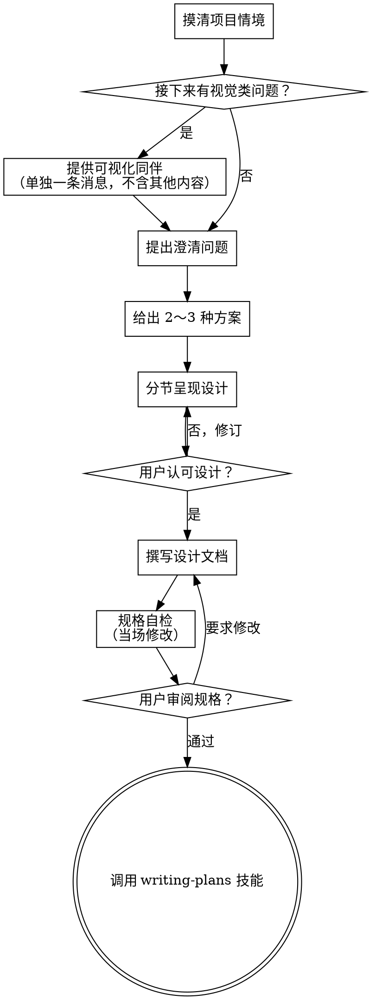

# 将想法脑暴成设计

通过自然的协作式对话，帮助把想法落实为完整的设计与规格说明。

先理解当前项目情境，再**每次只问一个问题**以收敛需求。弄清要做什么之后，给出设计并请用户确认。

<HARD-GATE>
在**展示设计且用户明确同意之前**，不得调用任何「实现类」技能、不得写代码、不得脚手架、不得采取任何实现动作。无论项目看起来多简单，**一律适用**。
</HARD-GATE>

## 反模式：「这太简单了，不需要设计」

每个项目都要走完整流程。待办清单、单函数工具、改一行配置——**全部算**。所谓「简单」项目，往往最容易因**未说清的假设**而返工。设计可以很短（真正简单时几句话即可），但必须**先陈述设计并取得认可**。

## 检查清单

你必须为下列每一项建立任务，并**按顺序**完成：

1. **摸清项目情境** — 查看文件、文档、近期提交  
2. **提供可视化同伴**（若后续会涉及视觉问题）— **单独一条消息**，不与澄清问题混在一起。见下文「可视化同伴」一节。  
3. **提出澄清问题** — 一次一个，弄清目的、约束、成功标准  
4. **给出 2～3 种方案** — 说明取舍并给出你的推荐  
5. **呈现设计** — 按复杂度分节展开，**每一节**后征求用户是否认可  
6. **撰写设计文档** — 保存到 `docs/superpowers/specs/YYYY-MM-DD-<topic>-design.md` 并提交 git  
7. **规格自检** — 快速扫一遍占位符、矛盾、歧义、范围（见下文）  
8. **用户审阅成文规格** — 请用户在继续前阅读规格文件  
9. **进入实现阶段** — 调用 **writing-plans** 技能生成实现计划  

## 流程图

**终态是调用 writing-plans。** 不要在此之后调用 frontend-design、mcp-builder 或其他实现类技能。脑暴结束后**唯一**应调用的下一技能是 **writing-plans**。

## 流程说明

**理解想法：**

- 先查看当前项目状态（文件、文档、近期提交）  
- 在追问细节前评估范围：若需求包含多个**彼此独立**的子系统（例如「做一个带聊天、文件、计费、分析的平台」），要**立刻点明**。不要在一个本该先拆分的项目上花大量问题抠细节。  
- 若对单一规格而言过大，帮用户拆成子项目：各自独立部分是什么、如何关联、建议实现顺序？然后对**第一个子项目**按正常设计流程脑暴。每个子项目各自走 **规格 → 计划 → 实现** 周期。  
- 对范围合适的项目，**一次一个问题**收敛想法  
- 尽量用选择题，开放式也可以  
- **每条消息最多一个问题**——若某主题需要展开，拆成多条问题  
- 重点弄清：**目的、约束、成功标准**  

**探索方案：**

- 提出 **2～3** 种不同做法，并说明取舍  
- 用对话语气呈现选项，附上**推荐项及理由**  
- **先亮推荐**，再解释为什么  

**呈现设计：**

- 自认已理解要构建的内容后，再整体呈现设计  
- 各节篇幅随复杂度伸缩：简单则几句话，复杂可 200～300 字量级  
- **每节结束后**问用户目前方向是否 OK  
- 覆盖：架构、组件、数据流、错误处理、测试  
- 若有不通之处，随时准备回头澄清  

**为隔离与清晰而设计：**

- 把系统拆成较小单元，各自**单一职责**，通过**明确接口**通信，可独立理解与测试  
- 对每个单元应能回答：做什么、怎么用、依赖什么？  
- 能否不看内部就理解单元行为？改内部是否会轻易弄坏调用方？若否，边界需再划。  
- 边界清晰的小单元也更利于协作——你能同时在脑中容纳的代码更完整，修改也更稳。文件膨胀往往是「做得太多」的信号。  

**在既有代码库中工作：**

- 提出改动前先摸清现有结构与惯例，**跟随既有模式**  
- 若现有代码存在**且影响本次工作**的问题（如单文件过大、边界不清、职责纠缠），在设计里纳入**有针对性的改进**——像资深开发在动到的区域顺手把环境变好。  
- 不要借机做大范围无关重构，**紧扣当前目标**。  

## 设计确定之后

**文档：**

- 将已确认的设计（规格）写入 `docs/superpowers/specs/YYYY-MM-DD-<topic>-design.md`  
  - （若用户指定了其他规格路径，以用户偏好为准）  
- 若环境中有 **elements-of-style:writing-clearly-and-concisely** 技能，可使用以提升文笔  
- 将设计文档 **commit** 到 git  

**规格自检：**  
写完规格后，换一副「第一次读」的眼光快速检查：

1. **占位符扫描：** 是否有「TBD」「TODO」、未完成段落或含糊需求？当场补全。  
2. **内部一致性：** 各节是否自相矛盾？架构是否与功能描述一致？  
3. **范围检查：** 是否适合收敛为**一份**实现计划，还是需要再拆分？  
4. **歧义检查：** 是否有需求可作两种理解？若有，选定一种并写清楚。  

有问题就**当场改**，不必为自检再单独开一轮——改完继续。  

**用户审阅关卡：**  
自检通过后，请用户**先读过成文规格**再继续，例如：

> 「规格已写入并提交到 `<path>`。请审阅；若需要修改请告诉我，我们再开始写实现计划。」

等待用户回复。若要求修改，改完后重新跑一遍规格自检循环。**只有用户认可后**才能往下走。  

**实现：**

- 调用 **writing-plans** 技能生成详细实现计划  
- **不要**调用其他技能。下一步只能是 **writing-plans**。  

## 核心原则

- **一次一个问题** — 不要一次抛出一串问题  
- **优先选择题** — 在合适场景比开放式更易回答  
- **无情 YAGNI** — 设计里砍掉非必要功能  
- **比较多种方案** — 落定前始终给出 2～3 条路  
- **分步确认** — 先呈现设计、取得认可再推进  
- **保持灵活** — 发现说不通就回头澄清  

## 可视化同伴（Visual Companion）

在脑暴过程中用于展示线框、示意图、视觉选项等的浏览器侧辅助能力。它是**工具**，不是**模式**。用户接受只表示「在需要时可以用浏览器辅助」；**不表示**每个问题都要进浏览器。

**发出邀请：** 若你预判接下来会大量涉及视觉内容（ mockup、版式、示意图），**单独一条消息**征求同意，例如：

> 「接下来有些内容可能用网页展示会更清楚。我可以在对话里随时补原型/线框、示意图、对比图等。该能力较新，可能消耗较多 token。要试试吗？（需要打开本地 URL）」

**该邀请必须是独立一条消息。** 不要与澄清问题、上下文摘要或其他内容合并。消息里**只包含**上述邀请，然后等待用户回复。若用户拒绝，则全程仅用文本脑暴。

**逐题决策：** 即使用户同意，对**每一个问题**仍要单独判断用浏览器还是终端。标准：**用户是「看到」比「读到」更明白吗？**

- **用浏览器**：内容**本质上是视觉的** — 原型与线框、版式对比、架构示意图、并排视觉方案  
- **用终端**：内容**本质是文字** — 需求确认、概念选择、取舍列表、A/B/C/D 文字选项、范围决策  

与 UI 相关的问题**不等于**视觉问题。「这里的 personality 指什么？」是概念题 — 用终端。「哪种向导版式更好？」是视觉题 — 用浏览器。

若用户同意使用同伴，继续前请先阅读详细说明：  
`skills/brainstorming/visual-companion.md`
