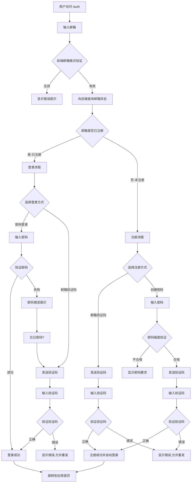

# Dream Log 统一认证系统实现计划

## 架构设计



## 第一阶段:基础 UI 组件 (frontend)

### 1. 复制模板组件到项目

从 `magic-ui-template/dillionverma-startup-template` 复制以下组件到 [`frontend/components/ui/`](frontend/components/ui/):

- `input.tsx` - 输入框组件
- `form.tsx` - 表单组件 (react-hook-form 集成)
- `label.tsx` - 标签组件

### 2. 创建认证专用 UI 组件

在 [`frontend/components/auth/`](frontend/components/auth/) 创建:

- `verification-code-input.tsx` - 6 位验证码输入框组件,支持自动聚焦和粘贴
- `password-strength-indicator.tsx` - 密码强度指示器
- `google-oauth-button.tsx` - Google OAuth 登录按钮

## 第二阶段:国际化配置

### 3. 扩展 i18n 配置

在 [`frontend/i18n/index.ts`](frontend/i18n/index.ts) 添加认证相关的翻译:

- `auth.welcome` - 欢迎标题
- `auth.emailPlaceholder` - 邮箱输入提示
- `auth.passwordPlaceholder` - 密码输入提示
- `auth.continueButton` - 继续按钮文本
- `auth.useVerificationCode` - 使用邮箱验证码
- `auth.createPassword` - 创建密码
- `auth.forgotPassword` - 忘记密码
- `auth.verificationCodeSent` - 验证码已发送提示
- `auth.invalidCode` - 无效的验证码
- `auth.resendCode` - 重新发送
- `auth.passwordRequirements` - 密码要求说明
- `auth.alreadyRegistered` - 邮箱已注册提示
- `auth.back` - 返回
- 支持中文、英文、日文三种语言

## 第三阶段:API 服务层

### 4. 创建认证 API 服务

在 [`frontend/lib/auth-api.ts`](frontend/lib/auth-api.ts) 创建:

```typescript
// 邮箱状态检查
checkEmailExists(email: string): Promise<{ exists: boolean }>

// 发送验证码
sendVerificationCode(email: string, purpose: 'signup' | 'login' | 'reset'): Promise<void>

// 验证验证码
verifyCode(email: string, code: string): Promise<{ token: string, user: User }>

// 密码强度验证
validatePasswordStrength(password: string): Promise<{ valid: boolean, errors: string[] }>

// 密码注册
signupWithPassword(email: string, password: string, code: string): Promise<{ token: string, user: User }>

// 密码登录
loginWithPassword(email: string, password: string): Promise<{ token: string, user: User }>

// Google OAuth 初始化
initiateGoogleOAuth(): Promise<{ authUrl: string }>

// Google OAuth 回调处理
handleGoogleOAuthCallback(code: string): Promise<{ token: string, user: User }>
```

### 5. 扩展现有 API 配置

更新 [`frontend/lib/api.ts`](frontend/lib/api.ts):

- 添加认证 token 存储常量
- 添加登录成功后的跳转逻辑

## 第四阶段:表单状态管理

### 6. 创建认证状态管理 Hook

在 [`frontend/hooks/use-auth-flow.ts`](frontend/hooks/use-auth-flow.ts) 创建:

```typescript
type AuthStep = 'email' | 'method-selection' | 'password-input' | 'code-input'
type AuthMode = 'login' | 'signup' | 'unknown'

// 管理整个认证流程的状态机
useAuthFlow() {
  const [step, setStep] = useState<AuthStep>('email')
  const [mode, setMode] = useState<AuthMode>('unknown')
  const [email, setEmail] = useState('')
  const [isLoading, setIsLoading] = useState(false)
  
  // 返回当前步骤、模式切换函数、导航函数等
}
```

## 第五阶段:认证页面实现

### 7. 创建统一认证页面

在 [`frontend/app/(auth)/auth/page.tsx`](frontend/app/\\\\\\\\\\(auth)/auth/page.tsx):

- 实现多步骤表单容器
- 根据 `useAuthFlow` 状态渲染不同步骤
- 包含返回按钮导航(每一步都可返回上一步)
- 左上角显示返回首页按钮

### 8. 创建各个步骤的表单组件

在 [`frontend/components/auth/`](frontend/components/auth/) 创建:

#### 8.1 `email-step.tsx`

- Google OAuth 按钮
- 分隔线 "或继续使用"
- 邮箱输入框(带实时格式验证)
- 继续按钮
- 点击继续时:调用 `checkEmailExists` API,根据结果切换到对应模式

#### 8.2 `method-selection-step.tsx`

- 显示用户邮箱
- 登录模式:显示 "使用邮箱验证码" 和 "使用密码" 两个选项
- 注册模式:显示 "使用邮箱验证码注册" 和 "创建密码" 两个选项
- 邮箱已注册时显示提示: "身份验证被阻止,此邮箱已注册"

#### 8.3 `password-input-step.tsx`

- 显示用户邮箱
- 密码输入框(带显示/隐藏切换)
- 登录模式:显示 "忘记密码?" 链接(点击切换到验证码流程)
- 注册模式:实时显示密码强度指示器,显示密码要求列表
- 继续按钮
- 点击继续时:
  - 登录:直接调用 `loginWithPassword`
  - 注册:先验证密码强度,通过后发送验证码并切换到验证码输入步骤

#### 8.4 `verification-code-step.tsx`

- 显示 "输入发送到 xxx@example.com 的验证码"
- 6 位验证码输入框组件
- 自动提交(输入完 6 位后自动验证)
- 验证失败显示 "无效的一次性代码"
- "立即重发" 链接(带倒计时,60 秒后可重发)
- 验证成功后:
  - 登录/邮箱验证码注册:直接登录成功
  - 密码注册:调用 `signupWithPassword` 完成注册

### 9. 创建 OAuth 回调页面

在 [`frontend/app/(auth)/auth/callback/google/page.tsx`](frontend/app/\\\\\\\\\\(auth)/auth/callback/google/page.tsx):

- 从 URL query 获取 OAuth code
- 调用 `handleGoogleOAuthCallback`
- 显示加载状态
- 成功后跳转到应用首页
- 失败显示错误并提供返回按钮

### 10. 创建认证布局

在 [`frontend/app/(auth)/layout.tsx`](frontend/app/\\\\\\\\\\(auth)/layout.tsx):

- 全屏居中布局
- 移除 Header/Footer
- 添加主题切换按钮(右上角)
- 添加语言切换(右上角)

## 第六阶段:表单验证与错误处理

### 11. 创建验证 Schema

在 [`frontend/lib/auth-schemas.ts`](frontend/lib/auth-schemas.ts) 使用 Zod 定义:

- `emailSchema` - 邮箱格式验证
- `passwordSchema` - 密码强度验证(8 位以上,包含大小写/数字/特殊符号中的至少 3 种)
- `verificationCodeSchema` - 6 位数字验证码

### 12. 统一错误处理

在 [`frontend/lib/auth-error-handler.ts`](frontend/lib/auth-error-handler.ts):

- 映射后端错误码到用户友好的多语言错误消息
- 处理网络错误、超时等异常情况

## 第七阶段:用户体验优化

### 13. 添加动画与过渡效果

使用 `framer-motion`:

- 步骤切换时的淡入淡出动画
- 错误提示的抖动动画
- 加载状态的旋转动画

### 14. 键盘快捷键支持

- Enter 键提交当前表单
- Escape 键返回上一步
- 验证码输入框自动聚焦和自动跳转

### 15. 响应式设计

- 桌面端:固定宽度居中卡片(400px)
- 移动端:全宽显示,适配小屏幕
- 确保在所有设备上可用性良好

## 实现补充说明

### 安全性考虑

1. **验证码保护**: 前端限制重发间隔(60 秒),后端应有频率限制
2. **密码要求**: 8 位以上,需包含大写、小写、数字、特殊符号中至少 3 类
3. **Token 存储**: 使用 localStorage 存储 JWT token
4. **HTTPS**: 生产环境必须使用 HTTPS

### 流程细节补充

1. **邮箱验证码注册**: 用户输入邮箱 → 发送验证码 → 输入验证码 → 注册成功自动登录 → 可在用户设置中添加密码
2. **密码注册**: 用户输入邮箱 → 创建密码(需验证强度) → 发送验证码 → 输入验证码 → 注册成功
3. **密码登录**: 输入邮箱 → 输入密码 → 登录成功
4. **邮箱验证码登录**: 输入邮箱 → 选择验证码方式 → 发送验证码 → 输入验证码 → 登录成功
5. **忘记密码**: 在密码登录页点击 "忘记密码" → 切换到验证码流程 → 验证成功后可选择是否设置新密码

### Google OAuth 流程

1. 前端点击 Google 按钮 → 调用 `initiateGoogleOAuth` 获取授权 URL
2. 重定向到 Google 授权页面
3. 用户授权后重定向到 `/auth/callback/google?code=xxx`
4. 回调页面调用后端接口用 code 换取 token
5. 保存 token 并跳转到应用首页

### 需要的依赖包

已在 `frontend/package.json` 中包含:

- `react-hook-form` - 表单状态管理
- `zod` + `@hookform/resolvers` - 表单验证
- `framer-motion` - 动画效果
- `axios` - HTTP 请求
- `sonner` - Toast 通知
- `lucide-react` - 图标库