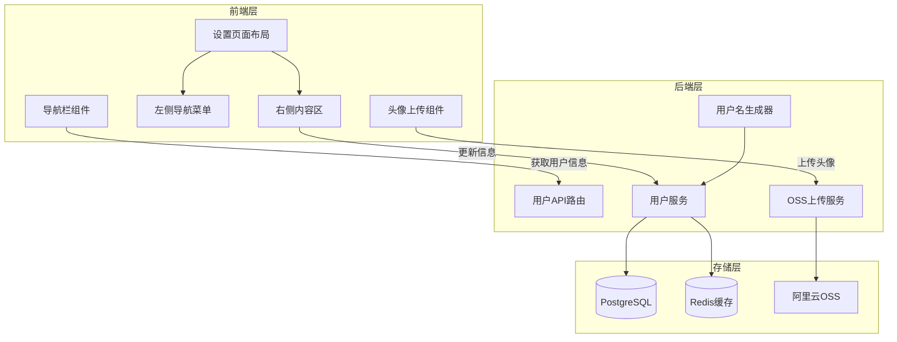
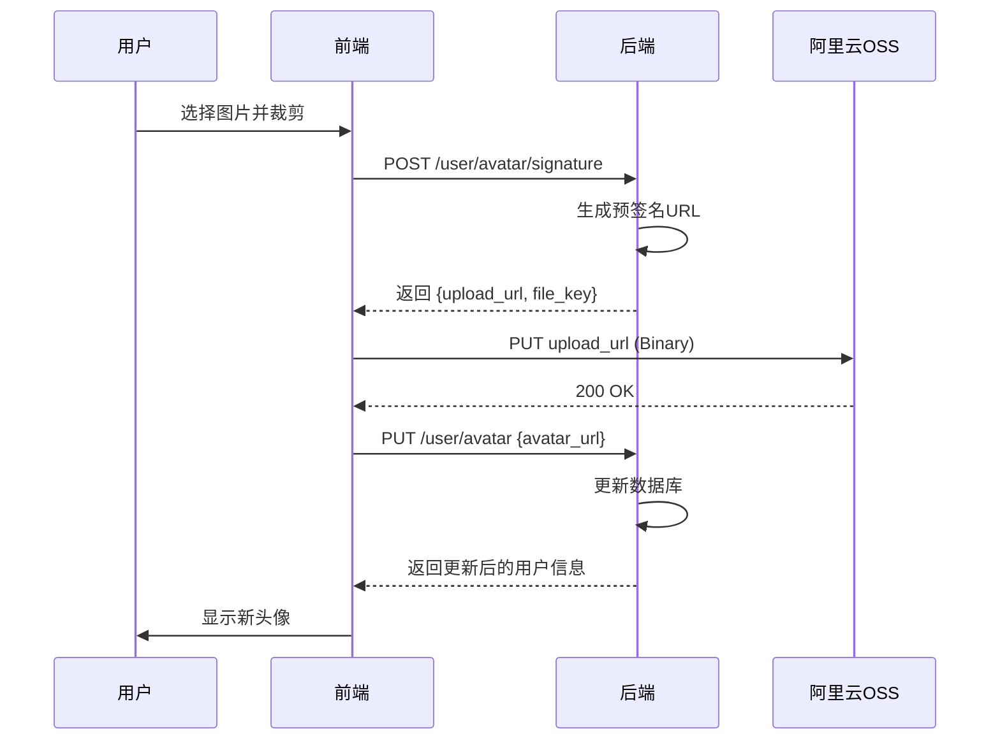
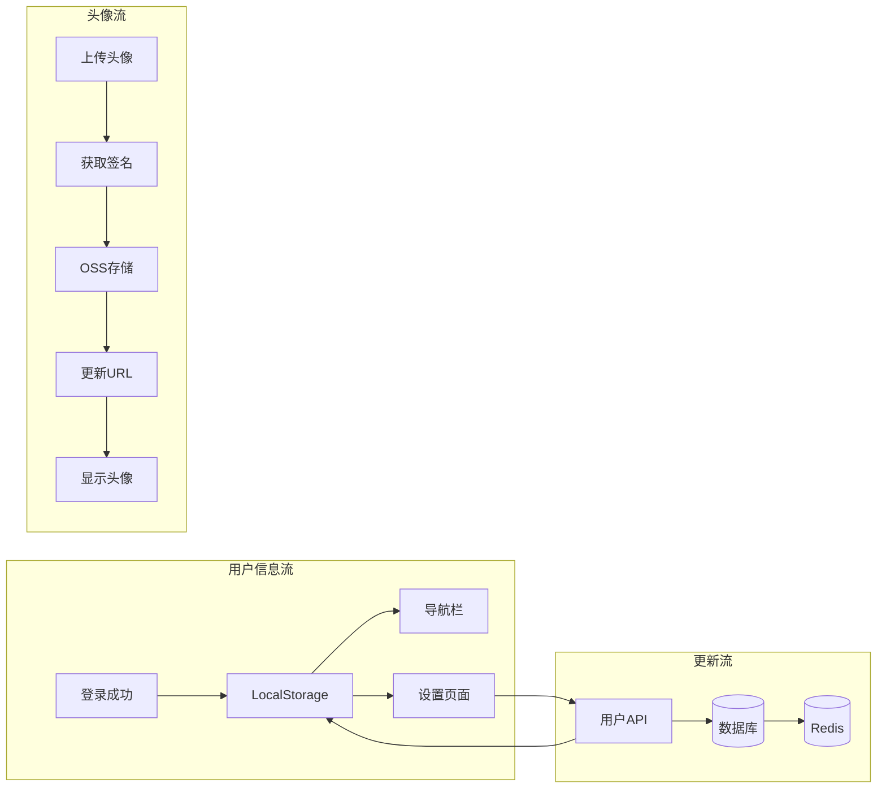

# 用户设置系统完整实现方案

## 架构概览




---

## 一、后端实现（backend）

### 1.1 数据库模型扩展

**文件**: `[backend/app/models/user.py](backend/app/models/user.py)`

需要为 `User` 模型添加新字段：

- `birthday`: 用户生日
- `bio`: 个人简介

创建 Alembic 迁移：

```bash
alembic revision --autogenerate -m "add_user_profile_fields"
```

### 1.2 OSS 上传服务

**文件**: `[backend/app/services/oss_service.py](backend/app/services/oss_service.py)`（新建）

参考旧项目 `legacy/backend/apps/dream/utils/oss.py`，实现：

- `generate_upload_signature()`: 生成预签名上传URL
- `get_avatar_upload_path()`: 获取头像存储路径（`users/{user_id}/avatars/`）
- `delete_avatar()`: 删除旧头像
- 支持 CORS 配置和环境变量管理

**环境变量**（`[backend/app/core/config.py](backend/app/core/config.py)`）：

```python
aliyun_oss_access_key_id: str
aliyun_oss_access_key_secret: str
aliyun_oss_endpoint: str
aliyun_oss_bucket_name: str
aliyun_oss_role_arn: str
```

### 1.3 用户名生成服务

**文件**: `[backend/app/services/username_service.py](backend/app/services/username_service.py)`（新建）

实现"形容词+动物"组合逻辑：

- 预定义形容词列表（50+）：Swift, Silent, Brave, Calm, Dream...
- 预定义动物列表（50+）：Falcon, Panda, Wolf, Phoenix, Owl...
- 基于用户UUID生成确定性但独特的组合
- 冲突检测：查询数据库确保唯一性，冲突时添加随机后缀

### 1.4 用户API路由

**文件**: `[backend/app/api/user.py](backend/app/api/user.py)`（新建）

API 端点设计：

| 端点 | 方法 | 功能 | 请求体/参数 |

|------|------|------|-------------|

| `/user/me` | GET | 获取当前用户完整信息 | - |

| `/user/profile` | PATCH | 更新个人资料 | `username`, `bio`, `birthday` |

| `/user/avatar/signature` | POST | 获取头像上传签名 | `file_name`, `content_type` |

| `/user/avatar` | PUT | 更新头像URL | `avatar_url` |

| `/user/password` | PUT | 修改密码 | `old_password`, `new_password` |

| `/user/email` | PUT | 修改邮箱 | `new_email`, `verification_code` |

### 1.5 用户服务层

**文件**: `[backend/app/services/user_service.py](backend/app/services/user_service.py)`（新建）

核心方法：

- `get_user_by_id()`: 通过ID获取用户
- `update_profile()`: 更新个人资料（含用户名唯一性检查）
- `update_avatar()`: 更新头像（删除旧头像）
- `change_password()`: 修改密码（验证旧密码）
- `change_email()`: 修改邮箱（需验证码确认）

---

## 二、前端实现（frontend）

### 2.1 导航栏组件升级

**文件**: `[frontend/components/site-header.tsx](frontend/components/site-header.tsx)`

核心变更：

1. **认证状态检测**：使用 `AuthToken.isAuthenticated()` 和 `AuthUser.get()`
2. **条件渲染**：
  - 未登录：显示"登录"和"注册"按钮
  - 已登录：显示用户头像 + 用户名
3. **头像组件**：
  - 默认头像：集成 DiceBear API（`https://api.dicebear.com/7.x/adventurer/svg?seed={userId}`）
  - 自定义头像：显示 OSS 存储的图片
  - 头像样式：圆形、带边框、悬浮效果
4. **交互效果**：
  - 悬浮显示 Tooltip："进入设置"
  - 点击跳转到 `/settings`

**示例代码片段**：

```tsx
{isAuthenticated ? (
  <Link href="/settings">
    <div className="user-avatar-wrapper" title="进入设置">
      <Avatar user={currentUser} />
      {currentUser.username && <span>{currentUser.username}</span>}
    </div>
  </Link>
) : (
  <div className="auth-buttons">
    {/* 登录注册按钮 */}
  </div>
)}
```

### 2.2 用户头像组件

**文件**: `[frontend/components/user-avatar.tsx](frontend/components/user-avatar.tsx)`（新建）

功能：

- 支持自定义头像（来自OSS）和默认头像（DiceBear）
- 响应式尺寸（sm/md/lg）
- 加载状态和错误处理

### 2.3 设置页面布局

**文件**: `[frontend/app/settings/layout.tsx](frontend/app/settings/layout.tsx)`（新建）

采用 Flexbox 两栏布局：

```tsx
<div className="settings-container">
  <aside className="settings-sidebar">
    <SettingsSidebar />
  </aside>
  <main className="settings-content">
    {children}
  </main>
</div>
```

**样式要点**：

- 左侧固定宽度（280px），右侧自适应
- 移动端响应式：侧边栏折叠为顶部 Tab
- 面包屑导航显示当前位置

### 2.4 设置侧边栏

**文件**: `[frontend/components/settings/settings-sidebar.tsx](frontend/components/settings/settings-sidebar.tsx)`（新建）

菜单结构：

```
个人资料
  ├─ 基本信息
  └─ 个人资料

账户管理
  ├─ 账户安全
  └─ 邮箱管理
```

高亮当前激活项，使用 `usePathname()` 匹配路由。

### 2.5 设置页面路由

| 路由 | 组件文件 | 功能 |

|------|----------|------|

| `/settings` | `app/settings/page.tsx` | 重定向到 `/settings/profile` |

| `/settings/profile` | `app/settings/profile/page.tsx` | 个人资料编辑 |

| `/settings/account` | `app/settings/account/page.tsx` | 账户安全（修改密码） |

| `/settings/email` | `app/settings/email/page.tsx` | 邮箱管理 |

### 2.6 个人资料页面

**文件**: `[frontend/app/settings/profile/page.tsx](frontend/app/settings/profile/page.tsx)`（新建）

核心模块：

1. **头像上传区**：
  - 当前头像预览（圆形，120px）
  - "更换头像"按钮触发文件选择
  - 弹窗裁剪器（使用 `react-easy-crop`）
  - 支持拖拽缩放
  - 上传流程：选择文件 → 裁剪 → 获取OSS签名 → 上传到OSS → 更新数据库
2. **用户名编辑**：
  - 输入框 + 实时可用性检查（防抖）
  - 规则提示：3-20字符，字母数字下划线
3. **生日选择器**：日期选择组件
4. **个人简介**：多行文本框（最多100字）

### 2.7 头像裁剪上传组件

**文件**: `[frontend/components/settings/avatar-upload-modal.tsx](frontend/components/settings/avatar-upload-modal.tsx)`（新建）

技术栈：

- `react-easy-crop`: 裁剪功能
- 自定义 Canvas 处理：生成裁剪后的 Blob
- 上传流程：
  1. 调用 `/user/avatar/signature` 获取预签名URL
  2. 使用 `fetch` PUT 方法上传到 OSS
  3. 调用 `/user/avatar` 更新数据库中的 URL
  4. 刷新本地用户状态

### 2.8 API 客户端扩展

**文件**: `[frontend/lib/user-api.ts](frontend/lib/user-api.ts)`（新建）

API 方法：

```typescript
export const userAPI = {
  getCurrentUser(): Promise<User>
  updateProfile(data: ProfileUpdate): Promise<User>
  getAvatarUploadSignature(fileName: string): Promise<UploadSignature>
  updateAvatar(avatarUrl: string): Promise<User>
  updatePreferences(prefs: Preferences): Promise<User>
  changePassword(oldPass: string, newPass: string): Promise<void>
  changeEmail(newEmail: string, code: string): Promise<void>
}
```

### 2.9 国际化文本扩展

**文件**: `[frontend/i18n/index.ts](frontend/i18n/index.ts)`

添加 `settings` 命名空间：

```typescript
settings: {
  sidebar: { profile: "个人资料", account: "账户管理", ... },
  profile: { title: "个人资料", username: "用户名", ... },
  avatar: { upload: "上传头像", crop: "裁剪头像", ... },
}
```

---

## 三、实现细节

### 3.1 默认头像生成

**前端逻辑**（`[frontend/lib/utils.ts](frontend/lib/utils.ts)`）：

```typescript
export function getDefaultAvatar(userId: string): string {
  return `https://api.dicebear.com/7.x/adventurer/svg?seed=${userId}`;
}
```

DiceBear 特点：

- 基于 `seed`（用户ID）生成唯一且一致的头像
- 风格可选：`adventurer`, `avataaars`, `bottts` 等
- 返回 SVG 格式，体积小、可缩放

### 3.2 用户名生成算法

**后端逻辑**（`backend/app/services/username_service.py`）：

```python
ADJECTIVES = ["Swift", "Silent", "Brave", "Calm", "Dream", ...]
ANIMALS = ["Falcon", "Panda", "Wolf", "Phoenix", "Owl", ...]

def generate_username(user_id: uuid.UUID) -> str:
    seed = int(user_id.hex[:8], 16)
    adj = ADJECTIVES[seed % len(ADJECTIVES)]
    animal = ANIMALS[(seed // len(ADJECTIVES)) % len(ANIMALS)]
    base = f"{adj}{animal}"
    
    # 检查唯一性
    if not username_exists(base):
        return base
    return f"{base}{random.randint(10, 99)}"
```

### 3.3 OSS 上传流程




### 3.4 账户安全功能

**修改密码**：

- 要求输入旧密码或者验证码验证身份
- 新密码符合强度要求（复用现有验证逻辑）
- 修改成功后发送邮件通知

**修改邮箱**：

1. 输入新邮箱
2. 发送验证码到新邮箱
3. 输入验证码确认
4. 更新邮箱（需要确保新邮箱未被占用）

---

## 四、技术栈与依赖

### 后端新增依赖

```toml
# pyproject.toml
oss2 = "^2.18.0"  # 阿里云OSS SDK
aliyun-python-sdk-core = "^2.14.0"  # STS Token
aliyun-python-sdk-sts = "^3.1.0"
```

### 前端新增依赖

```json
{
  "react-easy-crop": "^5.0.0",
  "@dicebear/collection": "^7.0.0",
  "date-fns": "^3.0.0"
}
```

---

## 五、数据流图




---

## 六、安全与性能考虑

### 安全措施

1. **OSS权限控制**：使用STS临时凭证，限制只能访问 `users/{user_id}/` 路径
2. **文件验证**：前端和后端双重校验文件类型和大小（最大5MB）
3. **用户名唯一性**：数据库唯一约束 + 实时检查
4. **密码修改**：必须验证旧密码或者邮箱验证码
5. **邮箱修改**：需要验证码二次确认

### 性能优化

1. **头像CDN**：OSS配置CDN加速
2. **Redis缓存**：缓存用户信息减少数据库查询
3. **防抖优化**：用户名可用性检查使用 500ms 防抖
4. **图片压缩**：前端裁剪后压缩为 JPEG（质量85）
5. **懒加载**：设置页面组件按需加载

---

## 七、测试要点

### 后端测试

- OSS 签名生成和过期验证
- 用户名生成的唯一性
- 密码/邮箱修改的权限验证

### 前端测试

- 头像上传完整流程
- 表单验证和错误提示
- 响应式布局（移动端/桌面端）
- 国际化文本切换

---

## 八、迁移与部署

### 数据库迁移

```bash
cd backend
alembic upgrade head
```

### 环境变量配置

在 `.env` 文件添加：

```env
ALIYUN_OSS_ACCESS_KEY_ID=xxx
ALIYUN_OSS_ACCESS_KEY_SECRET=xxx
ALIYUN_OSS_ENDPOINT=https://oss-cn-wuhan-lr.aliyuncs.com
ALIYUN_OSS_BUCKET_NAME=dreamlog-prod
ALIYUN_OSS_ROLE_ARN=acs:ram::xxx:role/oss-role
```

---

## 总结

本方案实现了一个完整的现代化用户设置系统，包含：

1. ✅ 智能导航栏：根据登录状态动态显示
2. ✅ 默认头像/用户名：基于用户ID生成独特且一致的标识
3. ✅ 专业设置页面：侧边栏导航 + 卡片式内容区
4. ✅ 头像上传：完整的裁剪、OSS上传、数据库更新流程
5. ✅ 账户管理：密码修改、邮箱修改（含验证码）
6. ✅ 梦境特色：AI分析开关、隐私级别等专属设置
7. ✅ 国际化支持：所有文本支持中英日三语切换

