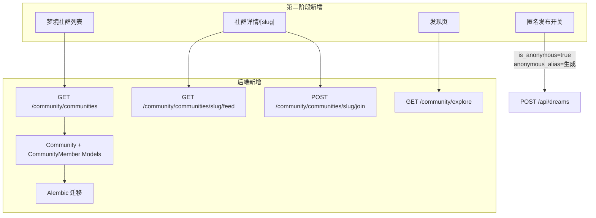

# 社区第二阶段实现方案

## 现状分析

第一阶段已实现：

- 基础 Feed、共鸣、评论、书签、举报的后端 API 和前端页面
- `is_seeking_interpretation`、`community_id`、`is_anonymous`、`emotion_tags` 字段已在 `dreams` 表中
- `communities` 和 `community_members` 表的 DDL 已写入计划文档，但**尚未创建对应 Alembic 迁移和 SQLAlchemy 模型**
- 后端 `get_feed` 中 `channel="greenhouse"` 无过滤逻辑（fallthrough 到 plaza）
- 前端情绪标签已在详情页渲染，但梦境卡片 `dream-card-social.tsx` 需确认是否完整显示
- 关注流排序 `sort=following` 后端逻辑已存在，前端 UI 已有 Tab，但测试完整性待确认
- 匿名发布字段已在数据库，但前端创建梦境页尚未提供匿名开关 UI
- 发现页和梦境社群子页面尚不存在

---

## 后端变更

### 1. Alembic 迁移（新建文件）

**文件**: `backend/alembic/versions/20260226_1200_add_community_groups.py`

创建 `communities` 和 `community_members` 两张表：

```python
op.create_table('communities',
    sa.Column('id', postgresql.UUID(), server_default=sa.text('gen_random_uuid()'), primary_key=True),
    sa.Column('name', sa.String(100), nullable=False),
    sa.Column('slug', sa.String(100), nullable=False, unique=True),
    sa.Column('description', sa.Text()),
    sa.Column('icon', sa.String(500)),
    sa.Column('cover_image', sa.String(500)),
    sa.Column('member_count', sa.Integer(), server_default='0'),
    sa.Column('post_count', sa.Integer(), server_default='0'),
    sa.Column('creator_id', postgresql.UUID(), sa.ForeignKey('users.id')),
    sa.Column('is_official', sa.Boolean(), server_default='false'),
    sa.Column('sort_order', sa.Integer(), server_default='0'),
    sa.Column('created_at', sa.TIMESTAMP(timezone=True), server_default=sa.text("timezone('Asia/Shanghai', now())")),
    sa.Column('updated_at', sa.TIMESTAMP(timezone=True)),
)
op.create_table('community_members',
    sa.Column('user_id', postgresql.UUID(), sa.ForeignKey('users.id', ondelete='CASCADE'), primary_key=True),
    sa.Column('community_id', postgresql.UUID(), sa.ForeignKey('communities.id', ondelete='CASCADE'), primary_key=True),
    sa.Column('joined_at', sa.TIMESTAMP(timezone=True), server_default=sa.text("timezone('Asia/Shanghai', now())")),
)
```

预置 4 个官方子社区（lucid / nightmare / serial / flying）via `op.execute()`。

### 2. SQLAlchemy 模型（新建文件）

**文件**: `backend/app/models/community_group.py`

```python
class Community(Base):
    __tablename__ = "communities"
    id, name, slug, description, icon, cover_image,
    member_count, post_count, creator_id, is_official, sort_order,
    created_at, updated_at

class CommunityMember(Base):
    __tablename__ = "community_members"
    user_id, community_id, joined_at
```

在 `backend/app/models/__init__.py` 中导出。

### 3. 更新 CommunityService（`[backend/app/services/community_service.py](backend/app/services/community_service.py)`）

新增方法：

- `get_communities()` — 返回社区列表（含当前用户是否已加入）
- `get_community_by_slug()` — 按 slug 返回社区详情
- `join_community()` — 加入/退出社区，更新 `member_count`
- `get_community_feed()` — 获取指定 `community_id` 的梦境流

修改 `get_feed()`:

- 为 `channel="greenhouse"` 增加过滤：`Dream.community_id.isnot(None)`（已加入社群的梦境）

匿名发布逻辑（已有字段，补充别名生成）：

- 在 `create_comment` 等处，若 `is_anonymous=True` 则生成 `anonymous_alias`（从预设词库随机组合）

发现页新增方法：

- `get_similar_dreamers()` — 根据标签交集推荐相似做梦者
- `get_recommended_communities()` — 推荐社群

### 4. Pydantic Schemas（`[backend/app/schemas/community.py](backend/app/schemas/community.py)`）

新增：

- `CommunityCreate`, `CommunityResponse`, `CommunityListResponse`
- `CommunityMemberResponse`
- `ExploreResponse`（汇总热门标签 + 活跃解读者 + 推荐社群 + 相似做梦者）

### 5. 更新 API 路由（`[backend/app/api/community.py](backend/app/api/community.py)`）

新增端点：

- `GET /community/communities` — 社群列表
- `GET /community/communities/{slug}` — 社群详情
- `GET /community/communities/{slug}/feed` — 社群内梦境流
- `POST /community/communities/{slug}/join` — 加入/退出社群
- `GET /community/explore` — 汇总发现页数据（trending-tags + active-interpreters + recommended-communities + similar-dreamers）

---

## 前端变更

### 1. 匿名发布开关（`[frontend/app/(app)/dreams/new/page.tsx](frontend/app/(app)`/dreams/new/page.tsx)）

在"是否寻求解读"Toggle 下方新增匿名发布开关：

```tsx
<div className="flex items-center justify-between p-4 rounded-xl border">
  <div>
    <p className="font-medium text-sm">匿名发布</p>
    <p className="text-xs text-muted-foreground">以"梦境漫游者"等随机别名发布</p>
  </div>
  <Switch checked={isAnonymous} onCheckedChange={setIsAnonymous} />
</div>
```

### 2. 发现/探索页面（新建）

**文件**: `frontend/app/(app)/community/explore/page.tsx`

布局：

- 热门标签云（可点击过滤 Feed）
- 推荐社群卡片列表（带"加入"按钮）
- 活跃解读者榜单
- 相似做梦者推荐

### 3. 梦境社群页面（新建）

- `frontend/app/(app)/community/greenhouse/page.tsx` — 社群列表页，展示所有官方社群
- `frontend/app/(app)/community/greenhouse/[slug]/page.tsx` — 单个社群详情页，含该社群的梦境流

社群卡片包含：社群图标、名称、描述、成员数、帖子数、"加入"按钮。

### 4. 更新社区主页（`[frontend/app/(app)/community/page.tsx](frontend/app/(app)`/community/page.tsx)）

- 点击"梦境社群" Tab 不再直接过滤 Feed，而是**跳转到** `greenhouse/` 页面
- "关注流"排序 Tab：无登录时显示提示引导登录，而非直接报错
- 情绪标签：确保 `dream-card-social.tsx` 正确渲染 `emotion_tags`（补全样式）

### 5. 更新社区 API 客户端（新建文件）

**文件**: `frontend/lib/community-api.ts`

当前此文件不存在，但已被引用。创建完整的 API 客户端，包含所有第一阶段 + 第二阶段端点的封装。

### 6. 情绪标签完善（`[frontend/components/community/dream-card-social.tsx](frontend/components/community/dream-card-social.tsx)`）

确认情绪标签已渲染（现有代码已有），若缺少样式则补充颜色映射：

- 平静 → 蓝色
- 恐惧 → 紫色
- 快乐 → 橙色
- 悲伤 → 灰蓝
- 兴奋 → 绿色

### 7. i18n 翻译更新（`[frontend/i18n/index.ts](frontend/i18n/index.ts)`）

补充缺失的社区频道、社群、发现页相关 i18n key（中/英/日三语）。

---

## 数据流架构




---

## 关键实现细节

**匿名别名生成**（后端，在 `community_service.py` 或 `dream_service.py` 中）：

```python
DREAM_ADJECTIVES = ["午夜", "云端", "星光", "迷雾", "流浪", "深海"]
DREAM_NOUNS = ["漫游者", "做梦人", "旅行者", "探索者", "守望者"]
def generate_alias() -> str:
    return random.choice(DREAM_ADJECTIVES) + random.choice(DREAM_NOUNS)
```

**greenhouse 频道过滤修复**（后端 `get_feed`）：

```python
elif channel == "greenhouse":
    base = base.where(Dream.community_id.isnot(None))
```

**关注流无登录提示**（前端）：

```tsx
if (sort === "following" && !user) {
  return <LoginPrompt message="登录后查看关注者的梦境" />
}
```

