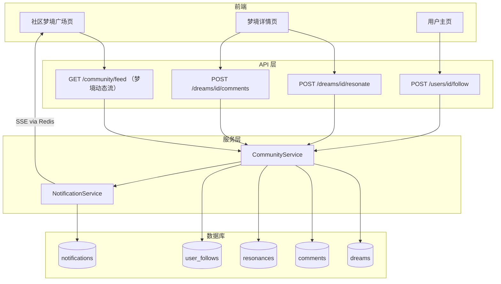

# DreamLog 梦境社区模块 - 完整实现方案

## 一、现有代码库基础评估

现有代码库已具备支持社区功能的基础要素，可直接复用：

- **隐私等级**：`Dream` 模型已存在 `PRIVATE / FRIENDS / PUBLIC` 枚举字段（[backend-v2/app/models/enums.py](backend-v2/app/models/enums.py)）
- **用户主页**：`User` 模型已有 `username`、`avatar`、`bio` 字段（[backend-v2/app/models/user.py](backend-v2/app/models/user.py)）
- **通知系统**：基于 SSE + Redis Pub/Sub 的实时通知已完整实现（[backend-v2/app/models/notification.py](backend-v2/app/models/notification.py)）
- **浏览统计**：Dream 模型已有 `view_count` 字段
- **相似梦境**：基于 pgvector 向量的相似梦境推荐已实现

---

## 二、产品架构优化建议

你的整体架构设计优秀，以下是针对性的细节优化：

### 1. 频道结构简化

频道作为社区梦境动态流的上层分类容器设计是正确的。但建议 MVP 阶段**不将各频道单独列入侧边栏**，而是：

- 社区页面在导航栏中只有**一个统一入口**
- 频道切换通过梦境广场顶部的**横向 Tab 栏**实现
- 这样可降低导航复杂度，保持侧边栏整洁

### 2. 梦境卡片交互精简

卡片上的互动按钮（共鸣 / 解读 / 评论）应遵循**渐进式披露**原则：

- **共鸣**（点赞）：单击即触发，始终显示在卡片上
- **解读数** + **评论数**：显示在卡片上，但点击后跳转至梦境详情页
- 避免卡片上交互元素过多造成视觉混乱

### 3. "寻求解读" UX 优化

创建梦境时，不使用单选按钮，而是采用更突出的**开关（Toggle）**配合上下文文案：

- 文案示例：`"希望社区帮我解读这个梦境"` — 意图更清晰
- 开启后自动将发布频道切换为"解梦圆桌"

### 4. 匿名发布机制设计（第二阶段）

匿名发布采用**梦境主题的伪匿名身份**，而非完全隐藏用户：

- 保障内容安全的同时给予隐私保护
- 每条匿名帖子随机生成梦境主题别名，例如"午夜漫游者"、"云端做梦人"

### 5. 右侧趋势面板

MVP 阶段右侧边栏**仅在桌面端（宽度 > 1280px）显示**，移动端隐藏。内容包括：热门标签、活跃解读者、相似做梦人。

---

## 三、数据库表结构设计（PostgreSQL 生产级）

### 新建表

```sql
-- 1. 梦境温室子社区（第二阶段，但 Schema 提前定义）
CREATE TABLE communities (
    id UUID PRIMARY KEY DEFAULT gen_random_uuid(),
    name VARCHAR(100) NOT NULL,
    slug VARCHAR(100) NOT NULL UNIQUE,
    description TEXT,
    icon VARCHAR(500),
    cover_image VARCHAR(500),
    member_count INTEGER DEFAULT 0,
    post_count INTEGER DEFAULT 0,
    creator_id UUID REFERENCES users(id),
    is_official BOOLEAN DEFAULT false,
    sort_order INTEGER DEFAULT 0,
    created_at TIMESTAMPTZ DEFAULT timezone('Asia/Shanghai', now()),
    updated_at TIMESTAMPTZ
);

-- 2. 子社区成员表（第二阶段）
CREATE TABLE community_members (
    user_id UUID REFERENCES users(id) ON DELETE CASCADE,
    community_id UUID REFERENCES communities(id) ON DELETE CASCADE,
    joined_at TIMESTAMPTZ DEFAULT timezone('Asia/Shanghai', now()),
    PRIMARY KEY (user_id, community_id)
);

-- 3. 梦境表社区扩展字段（ALTER 现有 dreams 表）
ALTER TABLE dreams ADD COLUMN is_seeking_interpretation BOOLEAN DEFAULT false;
ALTER TABLE dreams ADD COLUMN community_id UUID REFERENCES communities(id);
ALTER TABLE dreams ADD COLUMN is_anonymous BOOLEAN DEFAULT false;
ALTER TABLE dreams ADD COLUMN anonymous_alias VARCHAR(100);
ALTER TABLE dreams ADD COLUMN resonance_count INTEGER DEFAULT 0;
ALTER TABLE dreams ADD COLUMN comment_count INTEGER DEFAULT 0;
ALTER TABLE dreams ADD COLUMN interpretation_count INTEGER DEFAULT 0;
ALTER TABLE dreams ADD COLUMN inspiration_score FLOAT DEFAULT 0.0;
ALTER TABLE dreams ADD COLUMN is_featured BOOLEAN DEFAULT false;
ALTER TABLE dreams ADD COLUMN emotion_tags JSONB DEFAULT '[]';

-- 4. 共鸣表（等同于点赞）
CREATE TABLE resonances (
    id UUID PRIMARY KEY DEFAULT gen_random_uuid(),
    user_id UUID NOT NULL REFERENCES users(id) ON DELETE CASCADE,
    dream_id UUID NOT NULL REFERENCES dreams(id) ON DELETE CASCADE,
    created_at TIMESTAMPTZ DEFAULT timezone('Asia/Shanghai', now()),
    UNIQUE (user_id, dream_id)
);
CREATE INDEX idx_resonances_dream ON resonances(dream_id);
CREATE INDEX idx_resonances_user ON resonances(user_id);

-- 5. 评论表（支持解读与普通评论、嵌套回复）
CREATE TABLE comments (
    id UUID PRIMARY KEY DEFAULT gen_random_uuid(),
    dream_id UUID NOT NULL REFERENCES dreams(id) ON DELETE CASCADE,
    user_id UUID NOT NULL REFERENCES users(id) ON DELETE CASCADE,
    parent_id UUID REFERENCES comments(id) ON DELETE CASCADE,
    content TEXT NOT NULL,
    is_interpretation BOOLEAN DEFAULT false,  -- true 表示解读，false 表示普通评论
    is_adopted BOOLEAN DEFAULT false,          -- 作者采纳的解读
    like_count INTEGER DEFAULT 0,
    inspire_count INTEGER DEFAULT 0,
    is_anonymous BOOLEAN DEFAULT false,
    anonymous_alias VARCHAR(100),
    created_at TIMESTAMPTZ DEFAULT timezone('Asia/Shanghai', now()),
    updated_at TIMESTAMPTZ,
    deleted_at TIMESTAMPTZ                     -- 软删除
);
CREATE INDEX idx_comments_dream ON comments(dream_id, created_at);
CREATE INDEX idx_comments_user ON comments(user_id);
CREATE INDEX idx_comments_parent ON comments(parent_id);
CREATE INDEX idx_comments_interpretation ON comments(dream_id, is_interpretation)
    WHERE is_interpretation = true;

-- 6. 评论点赞/启发表
CREATE TABLE comment_likes (
    user_id UUID REFERENCES users(id) ON DELETE CASCADE,
    comment_id UUID REFERENCES comments(id) ON DELETE CASCADE,
    reaction_type VARCHAR(20) DEFAULT 'like',  -- 'like' 普通点赞 / 'inspire' 启发
    created_at TIMESTAMPTZ DEFAULT timezone('Asia/Shanghai', now()),
    PRIMARY KEY (user_id, comment_id)
);

-- 7. 用户关注关系表
CREATE TABLE user_follows (
    follower_id UUID REFERENCES users(id) ON DELETE CASCADE,
    following_id UUID REFERENCES users(id) ON DELETE CASCADE,
    created_at TIMESTAMPTZ DEFAULT timezone('Asia/Shanghai', now()),
    PRIMARY KEY (follower_id, following_id),
    CHECK (follower_id != following_id)
);
CREATE INDEX idx_follows_follower ON user_follows(follower_id);
CREATE INDEX idx_follows_following ON user_follows(following_id);

-- 8. 用户社区身份扩展字段（ALTER 现有 users 表）
ALTER TABLE users ADD COLUMN dreamer_title VARCHAR(50) DEFAULT '做梦者';
ALTER TABLE users ADD COLUMN dreamer_level INTEGER DEFAULT 1;
ALTER TABLE users ADD COLUMN inspiration_points INTEGER DEFAULT 0;
ALTER TABLE users ADD COLUMN public_dream_count INTEGER DEFAULT 0;
ALTER TABLE users ADD COLUMN interpretation_count INTEGER DEFAULT 0;
ALTER TABLE users ADD COLUMN follower_count INTEGER DEFAULT 0;
ALTER TABLE users ADD COLUMN following_count INTEGER DEFAULT 0;

-- 9. 收藏表（收藏社区公开梦境）
CREATE TABLE bookmarks (
    user_id UUID REFERENCES users(id) ON DELETE CASCADE,
    dream_id UUID REFERENCES dreams(id) ON DELETE CASCADE,
    created_at TIMESTAMPTZ DEFAULT timezone('Asia/Shanghai', now()),
    PRIMARY KEY (user_id, dream_id)
);

-- 10. 内容举报表
CREATE TABLE reports (
    id UUID PRIMARY KEY DEFAULT gen_random_uuid(),
    reporter_id UUID NOT NULL REFERENCES users(id) ON DELETE CASCADE,
    target_type VARCHAR(20) NOT NULL,    -- 'dream' 或 'comment'
    target_id UUID NOT NULL,
    reason VARCHAR(50) NOT NULL,
    description TEXT,
    status VARCHAR(20) DEFAULT 'pending',  -- pending / reviewed / resolved
    created_at TIMESTAMPTZ DEFAULT timezone('Asia/Shanghai', now())
);
```

### 通知类型扩展

```python
class NotificationType(str, enum.Enum):
    # 原有类型
    MONTHLY_REPORT = "MONTHLY_REPORT"
    WEEKLY_REPORT = "WEEKLY_REPORT"
    ANNUAL_REPORT = "ANNUAL_REPORT"
    # 社区新增类型
    RESONANCE = "RESONANCE"                        # 有人共鸣了你的梦境
    COMMENT = "COMMENT"                            # 有人评论了你的梦境
    INTERPRETATION = "INTERPRETATION"              # 有人解读了你的梦境
    INTERPRETATION_ADOPTED = "INTERPRETATION_ADOPTED"  # 你的解读被采纳
    NEW_FOLLOWER = "NEW_FOLLOWER"                  # 有新人关注了你
    DREAM_FEATURED = "DREAM_FEATURED"              # 梦境入选博物馆精选
    SIMILAR_DREAM = "SIMILAR_DREAM"                # 发现相似梦境
```

---

## 四、后端 API 设计

### 新增路由前缀：`/api/community`

**梦境动态流接口：**

- `GET /api/community/feed` — 公开梦境动态流（支持频道过滤、排序、分页）
  - 查询参数：`channel`（plaza / roundtable / greenhouse / museum）、`sort`（for_you / latest / resonating / following）、`community_id`、`page`、`page_size`
- `GET /api/community/feed/for-you` — 个性化梦境动态流（第三阶段，基于向量相似度 + 关注图谱）

**共鸣接口：**

- `POST /api/community/dreams/{dream_id}/resonate` — 切换共鸣状态（已共鸣则取消）
- `GET /api/community/dreams/{dream_id}/resonators` — 获取共鸣用户列表

**评论接口：**

- `GET /api/community/dreams/{dream_id}/comments` — 获取评论列表（支持按解读过滤）
- `POST /api/community/dreams/{dream_id}/comments` — 发表评论或解读
- `PATCH /api/community/comments/{comment_id}` — 修改评论
- `DELETE /api/community/comments/{comment_id}` — 删除评论（软删除）
- `POST /api/community/comments/{comment_id}/like` — 点赞 / 启发评论
- `POST /api/community/comments/{comment_id}/adopt` — 采纳解读（仅梦境作者可操作）

**关注接口：**

- `POST /api/community/users/{user_id}/follow` — 切换关注状态
- `GET /api/community/users/{user_id}/followers` — 粉丝列表
- `GET /api/community/users/{user_id}/following` — 关注列表

**用户主页接口：**

- `GET /api/community/users/{user_id}/profile` — 公开主页信息
- `GET /api/community/users/{user_id}/dreams` — 用户公开梦境列表

**子社区接口（第二阶段）：**

- `GET /api/community/communities` — 子社区列表
- `GET /api/community/communities/{slug}` — 子社区详情
- `POST /api/community/communities/{slug}/join` — 加入子社区

**发现接口：**

- `GET /api/community/explore/trending-tags` — 热门标签
- `GET /api/community/explore/active-interpreters` — 活跃解读者榜单
- `GET /api/community/explore/similar-dreamers` — 相似做梦人推荐

**收藏接口：**

- `POST /api/community/dreams/{dream_id}/bookmark` — 切换收藏状态
- `GET /api/community/bookmarks` — 我的收藏列表

**举报接口：**

- `POST /api/community/report` — 举报内容

### 对现有 API 的修改

**梦境创建**（[backend-v2/app/api/dreams.py](backend-v2/app/api/dreams.py)）：

- 在 `CreateDreamRequest` Schema 中新增：`is_seeking_interpretation`、`community_id`、`is_anonymous`、`emotion_tags`

**梦境详情**：

- 当 `privacy_level == PUBLIC` 时，返回中附加作者公开信息（username、avatar、dreamer_level）
- 附加互动计数（resonance_count、comment_count、interpretation_count）
- 附加当前用户互动状态（`has_resonated`、`has_bookmarked`）

---

## 五、前端架构设计

### 新增路由结构

```
frontend-v2/app/(app)/community/
├── page.tsx                    # 社区梦境广场主页
├── layout.tsx                  # 社区三栏布局
├── dream/[id]/page.tsx         # 社区梦境详情页
├── user/[id]/page.tsx          # 用户公开主页
├── greenhouse/page.tsx         # 梦境小圈子列表（第二阶段）
├── greenhouse/[slug]/page.tsx  # 子社区梦境动态流（第二阶段）
└── explore/page.tsx            # 发现页（第二阶段）
```

### 新增组件

```
frontend-v2/components/community/
├── community-feed.tsx          # 梦境动态流无限滚动容器
├── community-header.tsx        # 频道 Tab + 排序 Tab
├── dream-card-social.tsx       # 社交梦境卡片（含共鸣、计数）
├── dream-detail-social.tsx     # 增强版详情（Tab 切换）
├── comment-section.tsx         # 评论列表容器
├── comment-item.tsx            # 单条评论（含嵌套回复）
├── comment-input.tsx           # 评论/解读输入框（含类型切换）
├── interpretation-tab.tsx      # 解读 Tab 内容区
├── resonance-button.tsx        # 带动画的共鸣按钮
├── user-profile-card.tsx       # 用户名片（悬停/侧边栏）
├── follow-button.tsx           # 关注/取消关注按钮
├── trends-sidebar.tsx          # 右侧趋势侧边栏
├── community-sidebar.tsx       # 左侧频道侧边栏
├── bookmark-button.tsx         # 收藏切换按钮
├── report-dialog.tsx           # 举报弹窗
├── anonymous-toggle.tsx        # 匿名发布开关
└── similar-dreamers.tsx        # "X 人做过类似梦境"提示
```

### 社区梦境广场页面布局（桌面端）

```
+------------------+------------------------+------------------+
| 左侧边栏         | 主梦境动态流区域       | 右侧边栏         |
| (200px)          | (flex-1)               | (280px)          |
|                  |                        |                  |
| 社区导航         | 频道 Tab               | 热门标签         |
| - 梦境广场       | [梦境广场][解梦求助][梦境社群]... | #清醒梦 #飞翔    |
| - 解梦求助       |                        |                  |
| - 梦境社群       | 排序 Tab               | 活跃解读者       |
| - 精选梦境       | [推荐][最新][共鸣]...  | @user1 @user2    |
|                  |                        |                  |
| ---              | 梦境卡片               | 相似做梦人       |
| 我的主页         | 梦境卡片               | "3人做过类似梦"  |
| 我的收藏         | 梦境卡片               |                  |
|                  | ...无限滚动            |                  |
+------------------+------------------------+------------------+
```

移动端：单列布局，频道 Tab 可横向滚动，无侧边栏，底部标签导航。

### 导航栏更新

在 [frontend-v2/components/site-header.tsx](frontend-v2/components/site-header.tsx) 主导航栏中新增"梦境广场"入口（作为社区总入口）：

- 位置：位于"我的梦境"与"洞察"之间
- 文案示例：`梦境广场`
- 图标：人群 / 地球图标
- 激活色：青绿色渐变（与现有紫色/蓝色/橙色区分）

### i18n 翻译键新增

在 [frontend-v2/i18n/index.ts](frontend-v2/i18n/index.ts) 中新增 `community` 命名空间，包含：

- 频道名称（dreamPlaza、interpretHelp、dreamCommunities、featuredDreams）
- 排序标签（forYou、latest、resonating、following）
- 交互标签（resonate、interpret、comment、bookmark）
- 主页标签（dreamerLevel、inspirationPoints 等）
- 全部 UI 文案的中英日三语翻译

---

## 六、MVP 实现范围（第一阶段）

### 后端

1. Alembic 迁移：为 `dreams`、`users` 表新增社区字段
2. 新建表：`resonances`、`comments`、`comment_likes`、`user_follows`、`bookmarks`、`reports`
3. 新建模型：`Resonance`、`Comment`、`CommentLike`、`UserFollow`、`Bookmark`、`Report`
4. 新建 Schema：`CommunityFeedRequest`、`DreamCardSocial`、`CommentCreate`、`CommentResponse`、`UserPublicProfile`
5. 新建服务：`CommunityService`（Feed 查询、共鸣、评论、关注）
6. 新建路由：`community.py`（所有 MVP 接口）
7. 更新 `NotificationType` 枚举 + 对应迁移
8. 更新 `CreateDreamRequest` Schema（新增社区字段）
9. 更新 `NotificationService`（支持社区通知类型）

### 前端

1. 社区 Feed 页面（频道 Tab + 排序 Tab）
2. 社交梦境卡片组件
3. 社区梦境详情页（解读/评论 Tab 切换）
4. 带类型切换的评论/解读输入框
5. 带动画的共鸣按钮
6. 关注按钮
7. 用户公开主页
8. 收藏功能
9. 举报弹窗
10. 导航栏更新（新增社区链接）
11. i18n 三语翻译
12. 移动端响应式布局

### 数据流向图




---

## 七、第二阶段功能（MVP 之后）

- 解梦求助频道（基于 `is_seeking_interpretation` 过滤的专属梦境动态流）
- 梦境社群（基于 `communities` 表的子社区系统）
- 梦境卡片情绪标签显示
- 发现 / 探索页面
- 匿名发布（伪匿名身份机制）
- 关注流（`sort=following` 仅显示关注者的梦境）

## 八、第三阶段功能（增强期）

- 精选梦境（基于 `is_featured` + `inspiration_score` 的精选梦境展示）
- 灵感值积分系统
- 筑梦师等级 / 称号体系
- "为你推荐"梦境动态流（基于向量嵌入的个性化推荐）

## 九、第四阶段功能（长期规划）

- 实时聊天
- 高级推荐算法
- 社区内容审核工具

