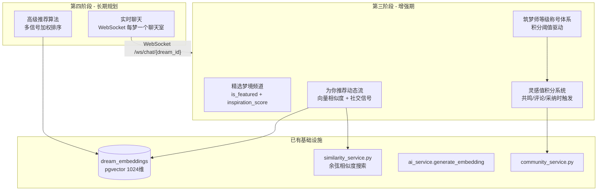
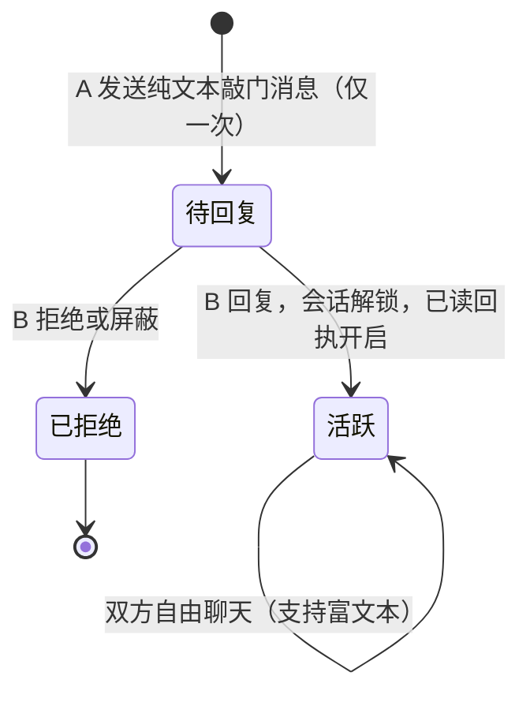

# 第三、四阶段：社区增强期与长期规划功能

## 整体架构图




---

## 第三阶段：增强期

### 1. 灵感值积分 & 筑梦师等级称号体系（后端）

**已有基础：**

- `users` 表已有 `inspiration_points`、`dreamer_level`、`dreamer_title` 字段（第一阶段迁移 `20260226_1000` 已添加）
- `UserPublicProfile` Schema 已包含上述字段，**无需新建迁移**

**新增逻辑 - `[backend/app/services/community_service.py](backend/app/services/community_service.py)`：**

添加 `_award_points(user_id, action, db)` 辅助方法，各动作积分规则：

- 发布公开梦境：+5 分
- 收到他人共鸣：+2 分
- 发表评论/解读：+3 分
- 解读被采纳：+20 分
- 梦境被精选：+50 分

添加 `_update_dreamer_level(user_id, db)` 方法，根据积分阈值自动更新等级和称号：

- Lv.1（0分）：做梦者
- Lv.2（50分）：梦境探索者
- Lv.3（200分）：梦境记录师
- Lv.4（500分）：筑梦师
- Lv.5（1000分）：梦境大师
- Lv.6（2000分）：造梦先知

在现有方法中挂载调用：`toggle_resonance()`、`create_comment()`、`adopt_interpretation()`。

---

### 2. 精选梦境频道（后端）

**已有基础：**

- `dreams.is_featured` 字段（Boolean）
- `dreams.inspiration_score` 字段（Float）
- `community/page.tsx` 已有 "museum"（梦之博物馆）频道 Tab

**需要修改：**

- `[community_service.py](backend/app/services/community_service.py)` → `get_feed()`：`channel == "museum"` 时按 `is_featured=True` 过滤，并按 `inspiration_score DESC` 排序
- 新增管理端点 `POST /community/dreams/{dream_id}/feature`（仅管理员可用），用于切换 `is_featured` 状态并重算灵感分
- 灵感分公式：`resonance_count × 2 + comment_count × 1.5 + interpretation_count × 3`
- 在 `[dream_analysis_tasks.py](backend/app/tasks/dream_analysis_tasks.py)` 中新增 `update_inspiration_scores()` 后台任务，定期重算公开梦境灵感分，自动将高分梦境标记为精选

---

### 3. 「为你推荐」个性化动态流（后端）

**已有基础：**

- `dream_embeddings` 表（1024维 pgvector 向量）
- `ai_service.generate_embedding()` 方法
- `similarity_service.py` 中的 `find_similar_dreams()`

**新增服务方法 `[community_service.py](backend/app/services/community_service.py)`：**

```python
async def get_personalized_feed(self, user_id, page, page_size) -> FeedResponse:
    # 1. 取用户最近 10 条梦境的 embedding 作为品味画像
    # 2. 求平均得到中心向量
    # 3. 用余弦相似度查询最近邻公开梦境（排除自己的、已共鸣的）
    # 4. 若作者在关注列表中，提升权重
    # 5. 返回排序后的 FeedResponse
```

通过现有 `GET /community/feed?sort=foryou` 路由触发，在 `get_feed()` 中增加 `foryou` 分支调用此方法。

**新建迁移 `20260226_1300_add_foryou_index.py`：** 为 `dream_embeddings` 添加仅对公开梦境生效的 HNSW 向量索引，加速个性化查询。

---

### 4. 前端 UI 变更（第三阶段）

`**[frontend/app/(app)/community/page.tsx](frontend/app/(app)`/community/page.tsx)：**

- 在 `SORTS` 排序选项首位添加 `"foryou"`（"为你推荐"），已登录时显示，未登录则引导登录
- 「梦之博物馆」频道卡片上展示灵感分徽章

`**[frontend/lib/community-api.ts](frontend/lib/community-api.ts)`：**

- `FeedSort` 类型新增 `"foryou"`
- 新增 `featureDream(dreamId)` 管理员接口方法

`**[frontend/app/(app)/community/dreams/[id]/page.tsx](frontend/app/(app)`/community/dreams/[id]/page.tsx)：**

- `is_featured=true` 时显示精选徽章
- 用户信息卡片上显示 `inspiration_points` 灵感值

**新建组件 `[frontend/components/community/dreamer-level-badge.tsx](frontend/components/community/dreamer-level-badge.tsx)`：**

- 显示等级数字 + 称号文字，按等级色阶显示不同颜色徽章
- 在社区 Feed 卡片、用户主页、评论区统一复用

`**[frontend/i18n/index.ts](frontend/i18n/index.ts)`：** 新增 `foryou`、各等级称号、`featuredBadge`、`inspirationPoints` 等中英日三语翻译 key。

---

## 第四阶段：长期规划

### 5. WebSocket 实时聊天

**架构：** 每个梦境详情页对应一个 WebSocket 聊天室，消息持久化到 `chat_messages` 表，并广播给当前房间内所有连接的客户端。

**新建迁移 `20260226_1400_add_chat_messages.py`：**

```sql
CREATE TABLE chat_messages (
  id UUID PRIMARY KEY DEFAULT gen_random_uuid(),
  dream_id UUID NOT NULL REFERENCES dreams(id) ON DELETE CASCADE,
  user_id UUID NOT NULL REFERENCES users(id) ON DELETE CASCADE,
  content TEXT NOT NULL,
  created_at TIMESTAMPTZ DEFAULT timezone('Asia/Shanghai', now())
);
CREATE INDEX ON chat_messages(dream_id, created_at);
```

**新建模型 `[backend/app/models/chat.py](backend/app/models/chat.py)`：** `ChatMessage` SQLAlchemy ORM 模型。

**新建服务 `[backend/app/services/chat_service.py](backend/app/services/chat_service.py)`：**

- `get_recent_messages(dream_id, limit=50)` - 加载房间最近 50 条消息历史
- `save_message(dream_id, user_id, content)` - 持久化新消息到数据库

**新建 WebSocket 端点 `[backend/app/api/chat_ws.py](backend/app/api/chat_ws.py)`：**

- `WS /ws/chat/{dream_id}` - 进入房间、接收历史、广播新消息
- 连接管理器：`dict[str, set[WebSocket]]` 内存管理（与现有 `voice_ws.py` 同一模式）
- 鉴权：通过 query 参数 `?token=...` 传 JWT

在 `[backend/app/main.py](backend/app/main.py)` 中注册路由。

**新建前端组件 `[frontend/components/community/dream-chat.tsx](frontend/components/community/dream-chat.tsx)`：**

- 连接 `WS /ws/chat/{dream_id}?token=...`
- 展示最近 50 条消息，实时追加新消息
- 底部文本输入框 + 发送按钮
- 集成到梦境详情页 `community/dreams/[id]/page.tsx`，作为「实时聊天」新 Tab

---

### 6. 高级推荐算法

在「为你推荐」基础上引入多信号加权排序：

**信号及权重：**

- 向量相似度（用户品味画像匹配度）：40%
- 社交图谱加成（被关注作者的梦境）：25%
- 热度分（`inspiration_score`）：20%
- 时间衰减（指数衰减，半衰期 7 天）：15%

**实现方式：** 在 `community_service.py` 新增 `get_advanced_personalized_feed()` 方法，复用 `dream_embeddings` + pgvector 向量查询结果，在 Python 侧做多信号分数融合后返回。

通过环境变量 `ADVANCED_REC_ENABLED=true` 开关，开启后替换简单版「为你推荐」。**无需新建数据库表。**

---

### 7. 用户一对一私信（防骚扰 × 梦境社交深度设计）

**核心设计原则：** 发起方只能发送第一条"敲门消息"，对方回复后会话才真正开启。针对梦境社区高敏感、重情绪的产品特性，在基础防骚扰机制上额外进行三项深度强化。

**会话状态机：**



---

#### 强化一：敲门消息仅限纯文本（防视觉骚扰）

敲门消息在后端强制 `content_type = 'text'`，拒绝图片/链接/富文本，返回 `422`。
前端敲门输入框移除附件按钮，显示提示文案「首条消息仅支持文字，让真诚先行」。

**价值：** 过滤 90% 图片类恶意骚扰，同时倒逼发起者用真诚文字表达意图，提升回复率。

---

#### 强化二：梦境引用上下文卡片（解决"尬聊"问题）

当 A 从 B 的某个梦境详情页点击「发私信」时，该梦境 ID 作为 `source_dream_id` 存入会话。B 的接收界面在敲门消息上方展示该梦境的缩略卡片（标题 + 情绪标签 + 前 50 字预览），点击可跳转原帖。

**价值：** B 第一眼知道对方因何而来，大幅降低沟通阻力，提高回复率。

---

#### 强化三：Pending 状态隐藏已读回执（心理保护）

会话 `pending` 时，`is_read` 字段后端正常记录，但 API 响应对 `initiator` 强制返回 `false`，前端不显示"已读"标记。进入 `active` 状态后才展示真实已读状态。

**价值：** B 有权静默观察后拒绝，A 不会因"已读不回"产生挫败感，保护双方情绪。

---

**新建迁移 `20260226_1500_add_direct_messages.py`：**

```sql
CREATE TABLE dm_conversations (
  id UUID PRIMARY KEY DEFAULT gen_random_uuid(),
  initiator_id UUID NOT NULL REFERENCES users(id) ON DELETE CASCADE,
  recipient_id UUID NOT NULL REFERENCES users(id) ON DELETE CASCADE,
  status VARCHAR(20) NOT NULL DEFAULT 'pending',  -- pending / active / blocked
  source_dream_id UUID REFERENCES dreams(id) ON DELETE SET NULL,
  last_message_at TIMESTAMPTZ,
  created_at TIMESTAMPTZ DEFAULT now(),
  UNIQUE(initiator_id, recipient_id)
);

CREATE TABLE direct_messages (
  id UUID PRIMARY KEY DEFAULT gen_random_uuid(),
  conversation_id UUID NOT NULL REFERENCES dm_conversations(id) ON DELETE CASCADE,
  sender_id UUID NOT NULL REFERENCES users(id) ON DELETE CASCADE,
  content TEXT NOT NULL,
  content_type VARCHAR(20) NOT NULL DEFAULT 'text',  -- 敲门消息强制 text
  is_read BOOLEAN NOT NULL DEFAULT false,
  created_at TIMESTAMPTZ DEFAULT now()
);
CREATE INDEX ON direct_messages(conversation_id, created_at);
```

**发消息权限规则（`dm_service.py` 中执行）：**

- `pending`：`initiator` 不可再发（防轰炸）；`recipient` 发消息即激活会话变为 `active`
- `active`：双方自由发消息（支持富文本/图片）
- `blocked`：双方均不可发消息

**通知策略：**

- `pending`：仅在 B 首次收到时推送**一次**通知（标题：「有人敲门，来自梦境广场」），之后静默
- `active`：每条新消息正常推送通知

**新建后端文件：**

- `backend/app/models/dm.py`：`DmConversation`、`DirectMessage` SQLAlchemy 模型（含 `source_dream_id`、`content_type` 字段）
- `backend/app/services/dm_service.py`：
  - `get_or_create_conversation(initiator_id, recipient_id, source_dream_id?)` - 获取或新建会话
  - `send_knock(conversation_id, sender_id, content)` - 敲门消息（强制纯文本 + 仅限一次）
  - `reply_and_activate(conversation_id, sender_id, content)` - 首次回复激活会话
  - `send_message(conversation_id, sender_id, content)` - active 状态普通消息
  - `get_conversations(user_id)` - 会话列表（含来源梦境预览、未读数）
  - `get_messages(conversation_id, user_id, page)` - 分页消息历史（pending 时对 initiator 隐藏已读）
  - `block_conversation(conversation_id, user_id)` - 拒绝/屏蔽
  - `mark_read(conversation_id, user_id)` - 标记已读（仅 active 状态生效）
- `backend/app/api/dm.py`：REST 接口（会话列表、消息历史、发消息、屏蔽）
- 在 `backend/app/main.py` 注册 `dm.router`

**前端新建页面/组件：**

- 用户主页 `community/users/[id]/page.tsx`：「关注」旁新增「发私信」按钮，携带来源梦境 ID（若从梦境详情页进入）
- 会话列表页 `frontend/app/(app)/community/messages/page.tsx`：
  - 区分「待回复」（灰色半透明）和「活跃」状态，展示来源梦境标题预览和未读角标
- 私信详情页 `frontend/app/(app)/community/messages/[id]/page.tsx`：
  - 顶部：若有 `source_dream_id` 显示可折叠梦境引用卡片
  - `pending` + `initiator`：输入框禁用，显示「等待对方回复，敲门消息已发出」，无已读标记
  - `pending` + `recipient`：显示「回复即可开始聊天」，附「拒绝此次聊天」按钮
  - `active`：普通聊天输入框，显示已读勾号
- `frontend/components/site-header.tsx`：导航栏新增私信图标，带未读角标

---

## 涉及文件汇总

**后端（新建/修改）：**

- `backend/app/services/community_service.py` - 积分、等级、精选过滤、个性化推荐、高级推荐
- `backend/app/api/community.py` - 新增精选端点、foryou 排序分支
- `backend/app/tasks/dream_analysis_tasks.py` - 新增灵感分定期更新任务
- `backend/app/models/chat.py`（新建）
- `backend/app/services/chat_service.py`（新建）
- `backend/app/api/chat_ws.py`（新建）
- `backend/app/models/dm.py`（新建）- `DmConversation`、`DirectMessage` 模型
- `backend/app/services/dm_service.py`（新建）- 私信业务逻辑
- `backend/app/api/dm.py`（新建）- 私信 REST 接口
- `backend/app/main.py` - 注册聊天 WebSocket 路由、私信路由
- `backend/alembic/versions/20260226_1300_add_foryou_index.py`（新建）
- `backend/alembic/versions/20260226_1400_add_chat_messages.py`（新建）
- `backend/alembic/versions/20260226_1500_add_direct_messages.py`（新建）

**前端（新建/修改）：**

- `frontend/lib/community-api.ts` - 新增 foryou 排序类型、精选接口、私信接口
- `frontend/app/(app)/community/page.tsx` - 新增「为你推荐」排序 Tab
- `frontend/app/(app)/community/dreams/[id]/page.tsx` - 精选徽章、聊天 Tab
- `frontend/app/(app)/community/users/[id]/page.tsx` - 新增「发私信」按钮
- `frontend/app/(app)/community/messages/page.tsx`（新建）- 会话列表页
- `frontend/app/(app)/community/messages/[id]/page.tsx`（新建）- 私信详情页
- `frontend/components/community/dreamer-level-badge.tsx`（新建）
- `frontend/components/community/dream-chat.tsx`（新建）
- `frontend/components/site-header.tsx` - 导航栏新增私信图标（带未读角标）
- `frontend/i18n/index.ts` - 补充第三四阶段所有翻译 key（含私信相关）

