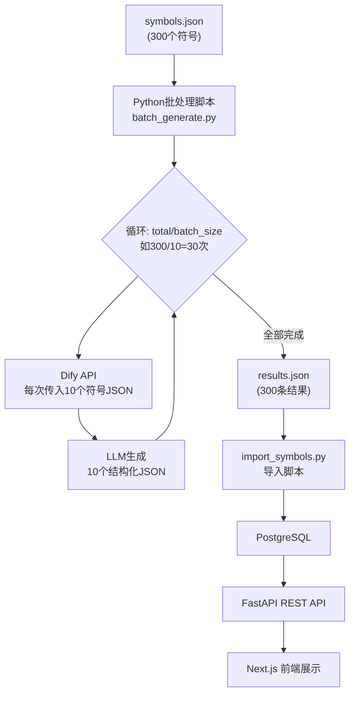

# 梦境探索模块开发计划

## 核心架构总览




---

## 第一步：工作流工具选型

**推荐：Dify（本地部署或云端）**

- n8n：偏向系统集成，做 AI 内容生成需要大量自定义节点，学习成本高
- Zapier：收费贵，不适合批量 AI 生成
- Coze：字节跳动产品，偏向聊天机器人，结构化输出控制较弱
- **Dify（✅ 推荐）**：专为 AI 应用设计，有原生「工作流」模式，支持结构化 JSON 输出，有批量运行（Batch Run）功能，免费开源可本地部署，对接 OpenAI/国内模型均可

---

## 第二步：数据库设计

### 新增表：`exploration_symbols`（梦境符号词典）

存储在 PostgreSQL，用 JSONB 存储结构化内容：

```sql
CREATE TABLE exploration_symbols (
    id UUID PRIMARY KEY DEFAULT gen_random_uuid(),
    slug VARCHAR(100) UNIQUE NOT NULL,       -- 唯一标识，如 "snake"
    name VARCHAR(100) NOT NULL,              -- 显示名称，如 "蛇"
    category VARCHAR(50) NOT NULL,           -- 分类：人物/动物/行为/地点/物体/情绪/身体/自然
    content JSONB NOT NULL,                  -- 结构化内容（见下方）
    search_vector TSVECTOR,                  -- 全文搜索
    created_at TIMESTAMPTZ DEFAULT NOW(),
    updated_at TIMESTAMPTZ DEFAULT NOW()
);
```

**JSONB content 字段结构（对应你的7个内容模块）：**

```json
{
  "core_meaning": { "headline": "...", "description": "..." },
  "personal_connection": "...",
  "common_scenarios": [
    { "scenario": "被蛇追", "meaning": "..." }
  ],
  "self_reflection_questions": ["...", "..."],
  "emotion_associations": ["焦虑", "恐惧", "紧张"],
  "why_you_dream_this": "...",
  "related_symbols": ["蜘蛛", "黑暗", "追逐"]
}
```

### 新增表：`exploration_articles`（科学基础/噩梦/改善指南）

```sql
CREATE TABLE exploration_articles (
    id UUID PRIMARY KEY DEFAULT gen_random_uuid(),
    module VARCHAR(50) NOT NULL,   -- "science" / "nightmare" / "improvement"
    section VARCHAR(100) NOT NULL, -- 章节标题
    order_index INTEGER DEFAULT 0,
    content JSONB NOT NULL,        -- 文章结构化内容
    created_at TIMESTAMPTZ DEFAULT NOW()
);
```

---

## 第三步：Dify 工作流搭建（手把手步骤）

### 3.1 注册并进入 Dify

访问 [https://cloud.dify.ai](https://cloud.dify.ai) 注册免费账号（或用 Docker 本地部署）。

### 3.2 创建「梦境符号批量生成」工作流

在 Dify 控制台：**创建应用 → 工作流（Workflow）**

**节点设计：**

```
[开始节点] → [LLM节点] → [代码节点（JSON校验与修复）] → [结束节点]
```

- **开始节点**：输入变量 `symbols`，类型选 **JSON（object）**
- **LLM 节点**：批量处理一批符号，输出 JSON 数组
- **代码节点**：校验输出格式，自动修复常见问题（如多余的 markdown 代码块标记）
- **结束节点**：输出 `results`（JSON 字符串）

**开始节点输入变量格式：**

```json
{
  "symbols": [
    {"name": "蛇", "category": "动物"},
    {"name": "坠落", "category": "行为"},
    {"name": "飞翔", "category": "行为"}
  ]
}
```

### 3.3 标准化 Prompt 模板（LLM节点）

```
你是一位专业的梦境心理内容编辑，专注于帮助用户理解自己，而不是解释理论知识。

你的目标不是解释符号本身，而是帮助用户理解自己的情绪、状态和内在体验。

现在请为以下梦境符号列表批量生成用户友好的解读内容：

{{#start.symbols#}}

------

# 核心写作原则（必须严格遵守）

通用原则：

- 必须使用温和、非权威语气
- 多使用：
  - “可能”
  - “也许”
  - “有时”
  - “这类梦境常见于…”
- 禁止使用：
  - “这意味着”
  - “代表了”
  - “说明你”
  - 任何绝对结论

用户优先原则：

- 所有内容必须以“用户体验”为中心，而不是解释符号本身
- 多使用“你”，帮助用户建立自我连接
- 避免理论术语
- 避免心理学术语
- 避免神经科学术语

语言要求：

- 简洁
- 自然
- 像一个理解用户的人，而不是专家讲课

------

# 字段生成规则（必须严格遵守）

输出 JSON 数组，数组长度必须与输入符号数量完全一致。

每个符号结构如下：

```

{
  "slug": "snake",
  "name": "蛇",
  "category": "动物",
  "content": {

```
"user_resonance": "一句强共鸣总结（20–40字）。描述这种梦常见于什么状态下的人。必须让用户感觉“这说的就是我”。",

"core_meaning": {
  "headline": "4–10字核心标签（必须是名词短语，不是句子，不使用句号）",
  "description": "2–3句说明，必须以“当你梦见…”或“这类梦境可能反映你…”开头"
},

"personal_connection": "2–3句引导用户反思现实状态的文字，帮助用户思考自己的生活和情绪",

"common_scenarios": [
  {
    "scenario": "具体场景名称",
    "meaning": "该场景可能反映的用户心理状态（1句）"
  },
  {
    "scenario": "具体场景名称",
    "meaning": "该场景可能反映的用户心理状态（1句）"
  },
  {
    "scenario": "具体场景名称",
    "meaning": "该场景可能反映的用户心理状态（1句）"
  }
],

"self_reflection_questions": [
  "必须是用户可以问自己的问题",
  "必须帮助用户自我理解",
  "必须具体",
  "必须现实相关"
],

"emotion_associations": [
  "必须是纯情绪词",
  "例如：焦虑、轻松、不安、恐惧、期待、困惑、安心",
  "禁止抽象词：转变、失控感、象征等"
],

"why_you_dream_this": "用通俗语言解释这种梦常见的心理原因（2–3句）。必须从用户体验角度解释，不要使用理论术语。",

"related_symbols": [
  "高度相关符号",
  "用户可能也会梦见的符号",
  "必须具体",
  "必须是单个词或短语"
]
```

  }
}

```

------

# 严格格式要求（必须遵守）

必须输出：

纯 JSON 数组

禁止输出：

- markdown代码块标记
- 解释文字
- 注释
- 额外内容

# 内容质量要求（关键）

user_resonance 必须像：

正确示例：

这种梦常见于你正在经历压力或面对不确定变化的时候。

错误示例（禁止）：

蛇象征变化

------

headline 示例：

正确：

潜在不安与警觉

错误：

可能象征潜在变化

------

common_scenarios 必须是对象数组，禁止字符串格式。

正确：

```

{
 "scenario": "被蛇追赶",
 "meaning": "可能反映你正在回避某种压力"
}

```

错误：

```

"被蛇追赶，可能反映压力"

```

------

# 最终输出格式（必须严格遵守）

输出必须是 JSON 数组，数组长度必须与输入符号数量完全一致。

不要输出任何 JSON 以外内容。
```

### 3.4 代码节点（JSON校验与修复）

在 Dify 代码节点中添加 Python 代码。

**节点配置：**

- 输入变量：`llm_output`，值设置为 `LLM → text（String）`
- 输出变量：`result`，类型选 `Array[Object]`

**重要**：不要使用 `re` 模块，Dify Python 沙箱对正则转义字符处理有 bug，必须改用字符串方法：

```python
import json

def main(llm_output: str) -> dict:
    text = llm_output.strip()

    # 去除开头的 
    if text.startswith("` `` "):
        first_newline = text.find("\n")
        if first_newline != -1:
            text = text[first_newline + 1:]
        else:
            text = text[3:]

    # 去除结尾的 
    if text.endswith("` ``"):
        text = text[:-3].strip()

    text = text.strip()

    # 解析 JSON
    results = json.loads(text)

    # 兼容两种输出格式：
    # 1. 直接是数组 [...]
    # 2. 包装在对象里 {"results": [...]} 或 {"symbols": [...]}
    if isinstance(results, dict):
        for key in ("results", "symbols", "data", "items"):
            if key in results and isinstance(results[key], list):
                results = results[key]
                break

    if not isinstance(results, list):
        raise ValueError("LLM 输出不是 JSON 数组，请检查 Prompt")

    return {"result": results}
```

### 3.5 获取 Dify API Key

工作流发布后，在 Dify 控制台 → **API 访问** 页面获取：

- `API Key`（格式：`app-xxxxxxxx`）
- `API Endpoint`（云端默认：`https://api.dify.ai/v1`）

---

## 第三步补充：Python 批处理脚本（核心自动化）

脚本位置：`backend-v2/scripts/symbols/`（梦境象征符号相关脚本统一放此目录）

**脚本配置参数（`batch_generate.py` 顶部，用户只需修改这里）：**

```python
# ========== 用户配置区 ==========
DIFY_API_KEY    = "app-xxxxxxxxxxxxxxxx"   # 你的 Dify API Key
DIFY_API_URL    = "https://api.dify.ai/v1/workflows/run"
BATCH_SIZE      = 10    # 每批处理的符号数量（建议 8-12）
DELAY_SECONDS   = 3     # 每批之间的间隔秒数（避免触发限流）
# 输入/输出文件固定为本目录：symbols_input.json、symbols_output.json、failed_batches.json
# ================================
```

**自动计算循环次数逻辑：**

```python
import math

total = len(symbols)          # 如 300
loops = math.ceil(total / BATCH_SIZE)  # 如 ceil(300/10) = 30 次循环

print(f"共 {total} 个符号，每批 {BATCH_SIZE} 个，共需循环 {loops} 次")
# 输出：共 300 个符号，每批 10 个，共需循环 30 次
```

**完整脚本执行流程：**

```
读取 symbols_input.json（300个符号）
    ↓
计算循环次数 = ceil(300 / BATCH_SIZE)
    ↓
循环第 1/30 批：取第 0-9 个符号 → 调用 Dify API → 收到10条结果 → 追加到结果列表
循环第 2/30 批：取第10-19个符号 → 调用 Dify API → 收到10条结果 → 追加到结果列表
... (等待 DELAY_SECONDS 秒)
循环第30/30 批：取第290-299个符号 → 调用 Dify API → 收到10条结果 → 追加到结果列表
    ↓
保存全部 300 条结果到 symbols_output.json
    ↓
打印完成报告（成功数/失败数/总耗时）
```

**输入文件格式 `symbols_input.json`：**

```json
[
  {"name": "蛇", "category": "动物"},
  {"name": "坠落", "category": "行为"},
  {"name": "飞翔", "category": "行为"},
  {"name": "追逐", "category": "行为"},
  ...
]
```

**运行命令：**

```bash
# 在 backend-v2 目录下运行
uv run python scripts/symbols/batch_generate.py
uv run python scripts/symbols/import_symbols.py

# 预期输出：
# 共 300 个符号，每批 10 个，共需循环 30 次
# [1/30] 处理 蛇、坠落、飞翔... ✓ (耗时 8.2s)
# ...
# 结果已保存至 scripts/symbols/symbols_output.json
```

**失败重试机制：**

- 单批失败自动重试最多 3 次
- 3次仍失败则记录到 `failed_batches.json`，可单独重跑失败批次
- 已成功的批次不会重复请求（断点续传）

---

## 第四步：后端 API（FastAPI）

### 新增文件

- `[backend-v2/app/models/exploration.py](backend-v2/app/models/exploration.py)` — SQLAlchemy 模型
- `[backend-v2/app/schemas/exploration.py](backend-v2/app/schemas/exploration.py)` — Pydantic 响应模型
- `[backend-v2/app/api/exploration.py](backend-v2/app/api/exploration.py)` — API 路由
- `[backend-v2/scripts/symbols/](backend-v2/scripts/symbols/)` — 梦境象征符号脚本目录
  - `symbols_input.json` — 符号输入清单（可扩展）
  - `batch_generate.py` — 调用 Dify API 批量生成
  - `import_symbols.py` — 将 symbols_output.json 导入 PostgreSQL
  - `README.md` — 使用说明

### API 端点设计

```
GET /api/exploration/symbols              # 符号列表（支持分类过滤、搜索）
GET /api/exploration/symbols/{slug}       # 符号详情
GET /api/exploration/symbols/categories   # 所有分类

GET /api/exploration/articles/{module}    # 文章内容（science/nightmare/improvement）
```

---

## 第五步：前端页面（Next.js）

### 新增文件/路由

- `[frontend-v2/app/(app)/exploration/page.tsx](frontend-v2/app/(app)`/exploration/page.tsx) — 模块主页（4个子模块入口卡片）
- `[frontend-v2/app/(app)/exploration/symbols/page.tsx](frontend-v2/app/(app)`/exploration/symbols/page.tsx) — 符号词典（搜索+分类）
- `[frontend-v2/app/(app)/exploration/symbols/[slug]/page.tsx](frontend-v2/app/(app)`/exploration/symbols/[slug]/page.tsx) — 符号详情（7层结构展示）
- `[frontend-v2/app/(app)/exploration/science/page.tsx](frontend-v2/app/(app)`/exploration/science/page.tsx) — 梦境科学基础
- `[frontend-v2/app/(app)/exploration/nightmare/page.tsx](frontend-v2/app/(app)`/exploration/nightmare/page.tsx) — 噩梦应对指南
- `[frontend-v2/app/(app)/exploration/improvement/page.tsx](frontend-v2/app/(app)`/exploration/improvement/page.tsx) — 梦境改善指南

### 导航栏修改

在 `[frontend-v2/components/site-header.tsx](frontend-v2/components/site-header.tsx)` 第 74 行「洞察报告」链接后添加「梦境探索」导航项，使用 `Compass` 图标（lucide-react 已有）。

### 符号详情页 UI 分层结构

```
核心含义（始终显示）
↓
这可能与你有关（始终显示）
↓
常见梦境场景（始终显示）
↓
你可以问问自己（始终显示）
↓
[可展开] 情绪关联
[可展开] 为什么会梦到这个
[可展开] 相关符号
```

---

## 执行顺序

- **Task 1**（我来做）：数据库表设计 + Alembic 迁移脚本
- **Task 2**（我来做）：后端 models / schemas / API + 三个脚本（symbols_input.json / batch_generate.py / import_symbols.py）
- **Task 3**（你手动）：在 Dify 搭建工作流，填入 Prompt，发布并获取 API Key
- **Task 4**（你手动）：填写 batch_generate.py 顶部的 API Key，运行脚本等待约5分钟，再运行 import_symbols.py 导入数据库
- **Task 5**（我来做）：前端路由、页面组件、导航栏
- **Task 6**（后续）：批量生成梦境科学/噩梦/改善文章内容并导入

