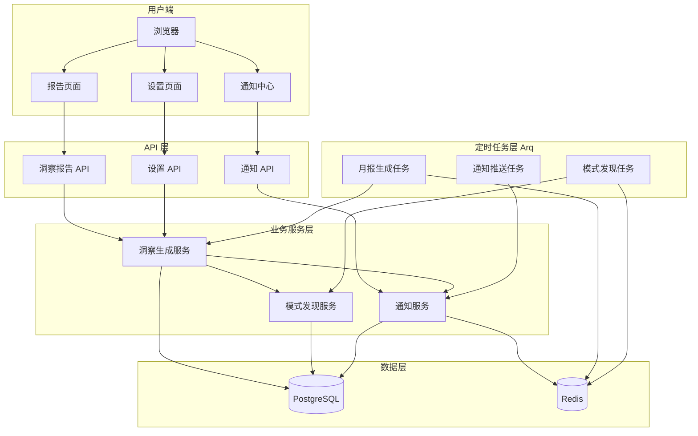
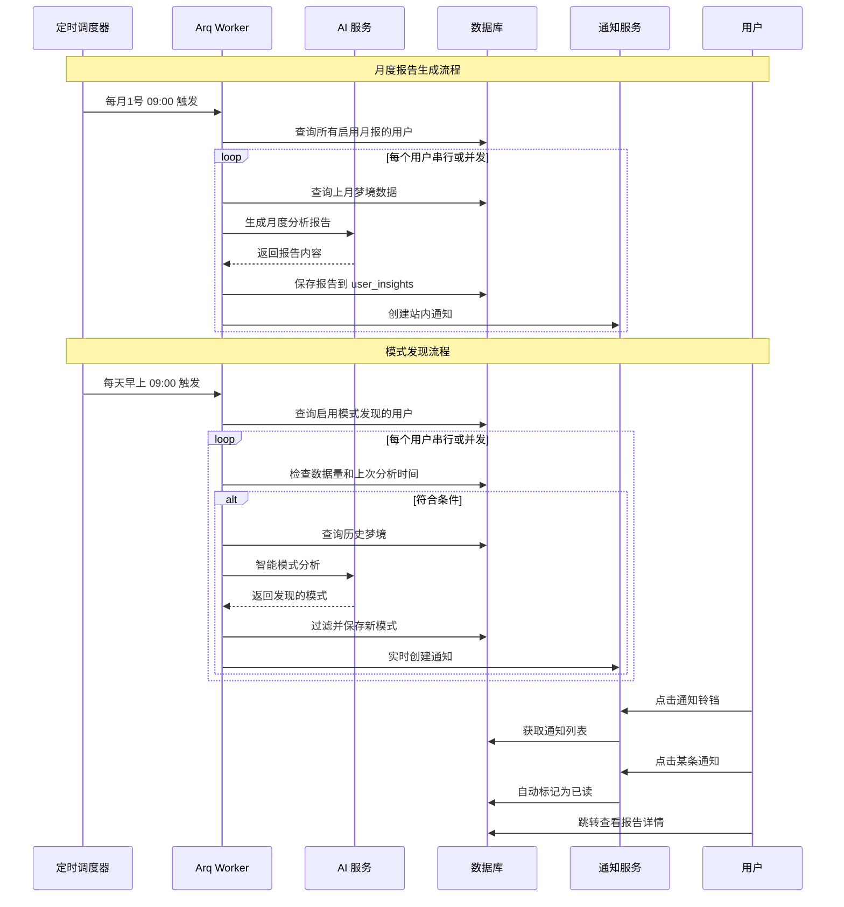

# 用户洞察报告系统实现方案

## 架构设计

### 系统架构图




### 数据流图




## 一、后端实现

### 1. 通知系统基础设施

#### 1.1 通知模型

新增 `backend/app/models/notification.py`：

- 表名：`notifications`
- 字段：
  - `id`: UUID 主键
  - `user_id`: 用户 ID（外键）
  - `type`: 通知类型枚举（MONTHLY_REPORT / PATTERN_DISCOVERY / 未来可扩展其他类型）
  - `title`: 通知标题
  - `content`: 通知内容（简短描述）
  - `link`: 跳转链接（如 `/insights/monthly/{id}` 或 `/insights/pattern/{id}`）
  - `metadata`: JSONB 字段（存储额外数据，如 `{"insight_id": "xxx", "report_month": "2026-02"}`）
  - `is_read`: 是否已读（Boolean，默认 false）
  - `created_at`: 创建时间

**设计说明：**

- 移除 `read_at` 字段：只需要 `is_read` 布尔值即可，简化设计
- 移除 `insight_id` 专用字段：使用通用的 `metadata` JSONB 字段，支持未来扩展（如关联梦境、用户反馈等）
- 通知类型可扩展：未来可添加系统公告、社交互动、成就解锁等通知类型

#### 1.2 通知服务

新增 `backend/app/services/notification_service.py`：

- `create_notification()` - 创建通知
- `get_user_notifications()` - 获取用户通知列表（分页、筛选）
- `mark_as_read()` - 标记单个通知为已读
- `mark_all_as_read()` - 标记全部已读
- `get_unread_count()` - 获取未读数量
- `delete_notification()` - 删除通知

使用 Redis 缓存未读数量：

```
Key: notification:unread:{user_id}
TTL: 5 分钟
```

#### 1.3 通知 API

新增 `backend/app/api/notifications.py`：

- `GET /api/notifications` - 获取通知列表
- `GET /api/notifications/unread-count` - 获取未读数量
- `POST /api/notifications/{id}/read` - 标记已读
- `POST /api/notifications/read-all` - 全部标记已读
- `DELETE /api/notifications/{id}` - 删除通知

### 2. 洞察生成服务

#### 2.1 月度报告生成

新增 `backend/app/services/insight_service.py`：

**核心方法：`generate_monthly_report(user_id, year, month)`**

步骤：

1. 查询该用户当月所有梦境数据
2. 数据验证（至少 3 个梦境才生成报告）
3. 统计基础数据：
  - 梦境总数、平均睡眠质量、情绪分布
  - 最常见的触发因素、梦境类型
  - 清醒程度、感官体验统计
4. 调用 AI 生成深度分析：
  - 情绪趋势解读
  - 睡眠质量关联分析
  - 个性化建议
  - 本月亮点时刻
5. 组装报告 JSON 数据结构：

```python
{
    "period": {"year": 2026, "month": 2},
    "statistics": {
        "total_dreams": 15,
        "avg_sleep_quality": 3.8,
        "emotion_distribution": {"joy": 0.35, "fear": 0.25, ...},
        "top_triggers": [{"name": "高压工作日", "count": 5}],
        "lucid_dreams": 2,
        "sensory_scores": {"visual": 0.8, "auditory": 0.6, ...}
    },
    "ai_analysis": {
        "emotion_trend": "本月情绪整体偏向焦虑...",
        "sleep_correlation": "睡眠质量与情绪残留显著相关...",
        "recommendations": ["建议1", "建议2"],
        "highlights": ["本月最有意思的梦境是..."]
    },
    "charts": {
        "emotion_timeline": [...],  # 情绪时间线数据
        "sleep_quality_trend": [...],  # 睡眠质量趋势
        "trigger_frequency": [...]  # 触发因素频率
    }
}
```

1. 保存到 `user_insights` 表
2. 生成标题：「2026年2月梦境月报」
3. 设置过期时间：6 个月后

**AI Prompt 设计**

新增 `backend/app/prompts/insight_generation.py`：

```python
MONTHLY_REPORT_PROMPT = """你是专业的梦境分析师，基于用户一个月的梦境数据生成月度报告。

数据摘要：
- 梦境总数：{total_dreams}
- 平均睡眠质量：{avg_sleep_quality}/5
- 情绪分布：{emotion_distribution}
- 主要触发因素：{top_triggers}

梦境详细内容：
{dream_contents}

请生成温暖、专业、有洞察力的月度分析报告，包含：
1. emotion_trend: 情绪趋势解读（150字）
2. sleep_correlation: 睡眠与梦境质量关联（100字）
3. recommendations: 3-5条个性化建议
4. highlights: 本月1-2个亮点时刻

返回 JSON 格式。
"""
```

#### 2.2 模式发现

新增 `backend/app/services/pattern_service.py`：

**核心方法：`discover_patterns(user_id)`**

智能过滤逻辑：

1. 检查数据量：至少 10 个梦境
2. 检查冷却期：距上次分析 ≥ 3 天
3. 查询历史梦境（最近 90 天）
4. 调用 AI 分析模式：
  - 重复出现的符号/场景
  - 情绪-触发因素关联
  - 时间规律（如周末 vs 工作日）
  - 睡眠质量与梦境内容的关联
5. 过滤低质量模式（置信度 < 0.75）
6. 去重：检查是否已存在相似模式
7. 保存新发现的模式
8. 返回模式列表

**AI Prompt 设计**

```python
PATTERN_DISCOVERY_PROMPT = """你是梦境模式分析专家，分析用户的历史梦境，发现有意义的模式。

用户最近 {dream_count} 个梦境：
{dream_data}

请识别以下类型的模式：
1. recurring_symbols: 重复出现的符号（至少3次）
2. emotion_trigger_links: 情绪-触发因素关联
3. temporal_patterns: 时间规律（如周末梦境特点）
4. sleep_quality_patterns: 睡眠质量与梦境内容关联

每个模式包含：
- pattern_type: 模式类型
- description: 描述（50字内）
- evidence: 证据（具体梦境引用）
- confidence: 置信度（0-1）
- insight: 心理学解读（100字内）

只返回置信度 >= 0.75 的模式，返回 JSON 格式。
"""
```

### 3. 洞察报告系统配置

新增 `backend/app/config/insight_config.py`：

```python
"""洞察报告系统配置"""

class InsightConfig:
    """洞察报告配置类"""
    
    # ========== 月度报告配置 ==========
    MONTHLY_REPORT_ENABLED = True
    MONTHLY_MIN_DREAMS = 3  # 最少梦境数量
    
    # ========== 模式发现配置 ==========
    PATTERN_DISCOVERY_ENABLED = True
    PATTERN_MIN_DREAMS = 10  # 最少梦境数量
    PATTERN_MIN_OCCURRENCES = 3  # 最少出现次数
    PATTERN_COOLDOWN_DAYS = 3  # 冷却期（天）
    PATTERN_MIN_CONFIDENCE = 0.75  # 最低置信度
    PATTERN_LOOKBACK_DAYS = 90  # 分析最近N天的梦境
    
    # ========== AI 调用并发控制 ==========
    AI_CONCURRENT_ENABLED = False  # 是否启用并发（默认串行）
    AI_MAX_CONCURRENT = 3  # 最大并发数（余额有限时建议 2-5）
    AI_REQUEST_DELAY = 2.0  # 串行模式下请求间隔（秒）
    
    # ========== 定时任务配置 ==========
    MONTHLY_REPORT_CRON_HOUR = 9  # 每月1号上午9点
    PATTERN_DISCOVERY_CRON_HOUR = 9  # 每天上午9点
    
    # ========== 数据管理 ==========
    INSIGHT_EXPIRE_MONTHS = 6  # 报告过期时间（月）
```

**配置说明：**

- **AI 并发控制**：默认串行避免 API 余额不足导致请求失败
- **并发开关**：可在配置文件中开启并发，适合余额充足的场景
- **请求延迟**：串行模式下每次请求间隔 2 秒，避免触发速率限制

### 4. 定时任务实现

#### 4.1 修改 Arq 配置

修改 `backend/app/core/arq_app.py`，添加 cron 任务支持：

```python
from arq import cron
from app.config.insight_config import InsightConfig

async def generate_monthly_reports(ctx):
    """每月1号早上9点生成月度报告"""
    # 调用 insight_service.generate_monthly_reports_for_all_users()
    pass

async def discover_patterns_batch(ctx):
    """每天早上9点批量发现模式"""
    # 调用 pattern_service.discover_patterns_for_all_users()
    pass

class WorkerSettings:
    # 现有配置...
    
    # 添加定时任务
    cron_jobs = [
        cron(
            generate_monthly_reports,
            month={1,2,3,4,5,6,7,8,9,10,11,12},
            day=1,
            hour=InsightConfig.MONTHLY_REPORT_CRON_HOUR,
            minute=0,
            unique=True
        ),
        cron(
            discover_patterns_batch,
            hour=InsightConfig.PATTERN_DISCOVERY_CRON_HOUR,
            minute=0,
            unique=True
        ),
    ]
```

#### 4.2 任务实现

新增 `backend/app/tasks/insight_tasks.py`：

**月度报告任务：**

```python
async def generate_monthly_reports_for_all_users():
    """为所有启用月报的用户生成报告"""
    users = await get_enabled_users(monthly_report_enabled=True)
    
    if InsightConfig.AI_CONCURRENT_ENABLED:
        # 并发模式：使用 semaphore 限制并发数
        semaphore = asyncio.Semaphore(InsightConfig.AI_MAX_CONCURRENT)
        tasks = [
            generate_with_semaphore(semaphore, user_id)
            for user_id in users
        ]
        await asyncio.gather(*tasks, return_exceptions=True)
    else:
        # 串行模式：逐个处理，避免过载
        for user_id in users:
            try:
                await generate_monthly_report(user_id)
                await asyncio.sleep(InsightConfig.AI_REQUEST_DELAY)
            except Exception as e:
                logger.error(f"生成月报失败: {user_id}, {e}")
```

**模式发现任务：**

```python
async def discover_patterns_for_all_users():
    """为所有启用模式发现的用户分析模式"""
    users = await get_enabled_users(pattern_discovery_enabled=True)
    
    if InsightConfig.AI_CONCURRENT_ENABLED:
        # 并发模式
        semaphore = asyncio.Semaphore(InsightConfig.AI_MAX_CONCURRENT)
        tasks = [
            discover_with_semaphore(semaphore, user_id)
            for user_id in users
        ]
        await asyncio.gather(*tasks, return_exceptions=True)
    else:
        # 串行模式：默认推荐
        for user_id in users:
            try:
                # 执行智能过滤
                if not await should_analyze_patterns(user_id):
                    continue
                await discover_patterns(user_id)
                await asyncio.sleep(InsightConfig.AI_REQUEST_DELAY)
            except Exception as e:
                logger.error(f"模式发现失败: {user_id}, {e}")
```

**关键特性：**

- 智能并发控制：根据配置选择串行或并发
- 异常隔离：单个用户失败不影响其他用户
- 延迟控制：串行模式下避免 API 速率限制
- 日志记录：便于监控和调试

### 4. API 端点

#### 4.1 洞察报告 API

新增 `backend/app/api/insights.py`：

- `GET /api/insights` - 获取洞察列表（分页、筛选类型）
- `GET /api/insights/{id}` - 获取报告详情
- `POST /api/insights/{id}/read` - 标记已读
- `DELETE /api/insights/{id}` - 删除报告
- `POST /api/insights/monthly/generate` - 手动生成月报（测试用）

#### 4.2 设置 API

修改 `backend/app/api/user.py`，添加：

- `GET /api/user/insight-settings` - 获取洞察设置
- `PUT /api/user/insight-settings` - 更新设置

### 5. 数据库迁移

新增迁移文件创建 `notifications` 表：

```bash
uv run alembic revision -m "add_notifications_table"
```

## 二、前端实现

### 1. 通知中心

#### 1.1 通知 Store

新增 `frontend/lib/stores/notification-store.ts`（使用 Zustand）：

- 状态：`notifications`、`unreadCount`、`loading`
- 方法：
  - `fetchNotifications()`
  - `fetchUnreadCount()`
  - `markAsRead(id)`
  - `markAllAsRead()`
  - `deleteNotification(id)`

#### 1.2 通知铃铛组件

新增 `frontend/components/notifications/notification-bell.tsx`：

- 位置：导航栏右上角
- UI：
  - 铃铛图标 + 未读数量徽章
  - 点击弹出 Popover 显示通知列表
  - 最多显示 5 条最新通知
  - 底部「查看全部」链接

#### 1.3 通知列表页面

新增 `frontend/app/(app)/notifications/page.tsx`：

- 完整的通知列表
- 分类筛选（全部 / 月报 / 模式发现）
- 标记已读 / 删除功能
- 点击通知跳转到对应报告

### 2. 洞察报告页面

#### 2.1 报告列表页

新增 `frontend/app/(app)/insights/page.tsx`：

布局：

- 顶部：筛选器（类型、时间范围）
- 主体：卡片列表
  - 月报卡片：显示月份、关键数据、未读标记
  - 模式卡片：显示模式类型、描述、发现时间

#### 2.2 月报详情页

新增 `frontend/app/(app)/insights/monthly/[id]/page.tsx`：

**页面结构（使用 Tabs 组件）：**

Tab 1: 总览

- 顶部：标题 + 时间范围
- 关键指标卡片（4个）：
  - 梦境总数
  - 平均睡眠质量
  - 清醒梦次数
  - 主导情绪
- AI 分析摘要（Card 组件）

Tab 2: 情绪分析

- 情绪分布饼图（ECharts）
- 情绪时间线折线图（ECharts）
- 情绪冲突指数趋势
- AI 解读文本

Tab 3: 睡眠与梦境

- 睡眠质量趋势图（折线图）
- 睡眠质量与梦境生动度关联图（散点图）
- 触发因素频率柱状图
- AI 关联分析

Tab 4: 个性化建议

- 建议列表（Card 布局）
- 每条建议包含：
  - 图标
  - 建议内容
  - 科学依据

Tab 5: 本月亮点

- 亮点时刻列表
- 点击跳转到具体梦境

#### 2.3 模式详情页

新增 `frontend/app/(app)/insights/pattern/[id]/page.tsx`：

**页面结构：**

- 模式类型徽章
- 模式描述
- 置信度进度条
- 证据展示：
  - 相关梦境列表
  - 高亮显示关键词
- AI 心理学解读
- 相关建议

### 3. 设置页面

#### 3.1 新增设置菜单项

修改 `frontend/components/settings/settings-sidebar.tsx`：

添加菜单项：

- 「洞察报告」（Insights）
- 图标：Sparkles

#### 3.2 洞察设置页面

新增 `frontend/app/settings/insights/page.tsx`：

**页面内容（使用 Card 布局）：**

Card 1: 月度报告

- 开关：启用月报
- 说明：每月1号自动生成上月梦境分析报告
- 通知开关：新报告生成时通知我

Card 2: 模式发现

- 开关：启用模式发现
- 滑块：最少出现次数（3-10次）
- 说明：当系统发现重复模式时自动通知
- 通知开关：发现新模式时通知我

Card 3: 数据管理

- 按钮：清理过期报告（6个月前）
- 统计：当前报告数量

### 4. UI 组件集成

#### 4.1 安装 ECharts

```bash
cd frontend
npm install echarts echarts-for-react
```

#### 4.2 封装图表组件

新增 `frontend/components/charts/`：

- `emotion-pie-chart.tsx` - 情绪分布饼图
- `emotion-timeline-chart.tsx` - 情绪时间线
- `sleep-trend-chart.tsx` - 睡眠质量趋势
- `trigger-bar-chart.tsx` - 触发因素柱状图
- `correlation-scatter-chart.tsx` - 关联散点图

配置 ECharts 主题自动适配：

- 监听 `next-themes` 的主题变化
- 动态切换 ECharts 主题（light / dark）

## 三、数据库迁移

### 迁移步骤

```bash
cd backend

# 1. 创建通知表迁移
uv run alembic revision -m "add_notifications_table"

# 2. 执行所有迁移
uv run alembic upgrade head
```

## 四、测试与验证

### 后端测试

1. 单元测试：
  - 洞察生成服务测试
  - 模式发现算法测试
  - 通知服务测试
2. 集成测试：
  - 定时任务执行测试
  - API 端点测试
3. 手动测试：
  - 使用测试账号生成月报
  - 触发模式发现
  - 验证通知推送

### 前端测试

1. 页面功能测试：
  - 报告列表加载
  - 图表渲染
  - 通知交互
2. 响应式测试：
  - 桌面端
  - 移动端
3. 主题切换测试：
  - 图表主题适配

## 五、部署配置

### 环境变量

添加到 `backend/.env`：

```bash
# 洞察报告配置
INSIGHT_MONTHLY_REPORT_ENABLED=true
INSIGHT_PATTERN_DISCOVERY_ENABLED=true
INSIGHT_PATTERN_MIN_DREAMS=10
INSIGHT_PATTERN_COOLDOWN_DAYS=3
INSIGHT_PATTERN_MIN_CONFIDENCE=0.75
```

### Worker 启动

确保 Arq Worker 运行以执行定时任务：

```bash
cd backend
uv run python scripts/start_worker.py
```

## 六、用户体验优化

### 1. 首次使用引导

当用户首次访问洞察页面时：

- 显示功能介绍卡片
- 解释月报和模式发现的价值
- 引导开启设置

### 2. 空状态处理

- 数据不足时显示友好提示
- 鼓励用户继续记录梦境
- 显示进度条（如「再记录 3 个梦境即可生成月报」）

### 3. 加载体验

- 使用骨架屏（Skeleton）
- 图表懒加载
- 分段渲染大量数据

### 4. 分享功能

- 生成月报分享图片
- 隐私控制（只分享统计数据，不含梦境内容）

## 预期效果

通过实现这套完整的洞察报告系统，你的应用将实现：

1. 用户留存提升：定期报告让用户形成查看习惯
2. 数据价值凸显：可视化展示让用户看到长期记录的意义
3. 差异化竞争力：AI 驱动的模式发现是独特卖点
4. 用户成长追踪：帮助用户了解自己的情绪和睡眠变化
5. 智能平台定位：从工具升级为智能分析平台

